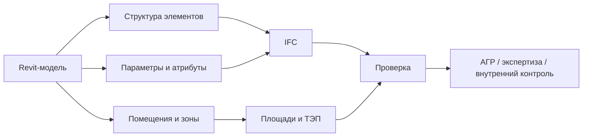

# Почему модель — это не картинка, а источник данных

## О чем эта глава

Это одна из главных опор всего учебника. Если ее не понять в самом начале, дальше IFC, параметры, зоны, ТЭП, АГР и экспертиза будут восприниматься как отдельные и плохо связанные темы.

## Простое объяснение темы

Когда новичок впервые видит BIM-модель, он часто воспринимает ее как красивую трехмерную картинку здания.

Но для BIM-процесса модель важна не сама по себе как изображение. Она важна как организованный набор данных:

- что это за элемент;
- где он находится;
- к какому уровню относится;
- какие у него свойства;
- как он связан с площадями, зонами и показателями;
- как он будет прочитан в IFC и проверках.

Именно поэтому одна и та же модель может выглядеть визуально “нормально”, но быть непригодной для передачи, проверки и расчета.

## Схема

Эту логику удобно удерживать как одну цепочку:

## Зачем это существует

Проекту нужна не просто картинка будущего здания. Проекту нужен рабочий источник информации, из которого можно:

- получать чертежи;
- считать площади и показатели;
- формировать IFC;
- передавать модель на проверку;
- находить ошибки в структуре и данных;
- готовить модель к АГР, экспертизе и внутреннему контролю.

На практике это означает: если модель собрана только ради визуального впечатления, она почти неизбежно начинает ломаться там, где нужна точность данных.

## Где это встречается в реальной работе

Эта мысль проявляется почти в каждой рабочей ситуации BIM-координатора.

Например:

- модель красиво выглядит в Revit, но при экспорте в IFC теряет смысловую структуру;
- площади на листах выглядят правдоподобно, но ТЭП не сходятся;
- элементы есть геометрически, но не имеют нужных атрибутов;
- фасад выглядит корректно, но данные модели не позволяют проверить требования автоматически.

Проверяющая система увидит модель не так, как ее видит человек на экране. Для системы важны структура, классы, параметры и логика связей.

## Как это связано с моделью

В модели данные живут в нескольких слоях сразу:

- в геометрии;
- в именовании и структуре элементов;
- в параметрах;
- в помещениях и зонах;
- в классификации;
- в экспортируемой IFC-логике.

Поэтому BIM-координатору недостаточно смотреть на картинку. Нужно понимать, как модель будет “прочитана” дальше: человеком, программой, проверяющей системой, экспертом, таблицей ТЭП или IFC-валидатором.

## Что должен делать BIM-координатор

Для BIM-координатора это важно потому что его работа начинается именно там, где заканчивается простое любование моделью.

Он должен:

- видеть, какие данные обязаны быть в модели;
- проверять, что модель пригодна не только для выпуска видов, но и для передачи;
- отслеживать связь между геометрией, параметрами, зонами и показателями;
- понимать, что красивый вид модели еще не означает качественную модель.

## Типовые ошибки новичков

- Считать, что если модель выглядит аккуратно, то с ней все в порядке.
- Сводить BIM к трехмерности.
- Думать, что параметры можно заполнить “потом, если попросят”.
- Не видеть связи между ошибкой в данных и провалом проверки.

## Короткий вывод

Главная мысль очень простая: модель ценна не потому, что она похожа на будущее здание, а потому что из нее можно достоверно получать и передавать информацию.

Если держать эту мысль в голове с самого начала, весь остальной учебник будет складываться намного легче. Если забыть ее, BIM снова превратится в набор красивых, но плохо связанных слов.
