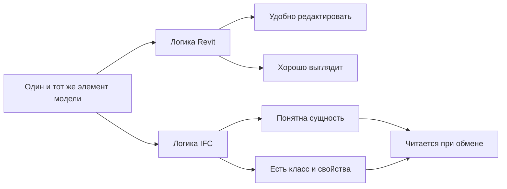

# Как думать в логике IFC, а не Revit

## О чем эта глава

Даже после знакомства с IFC новичок может продолжать мыслить только авторской средой. Тогда любая проблема обмена воспринимается как каприз формата, а не как следствие другой логики чтения модели.

Эта глава нужна, чтобы сделать один из самых важных профессиональных переходов: научиться смотреть на модель не только изнутри авторской программы.

## Простое объяснение темы

Думать в логике Revit — значит смотреть на модель прежде всего как на удобную авторскую рабочую среду.

Думать в логике IFC — значит смотреть на модель как на структуру сущностей и данных, которая должна быть понятна вне вашей программы.

Это не конфликт “что правильно”. Просто это два разных способа смотреть на одну и ту же модель.

## В чем разница мышления

В логике авторской среды человек часто спрашивает:

- удобно ли редактировать элемент;
- хорошо ли он выглядит в модели;
- можно ли быстро выпустить нужный вид;
- не мешает ли он рабочему процессу команды.

В логике IFC на первый план выходят другие вопросы:

- понятно ли, что это за сущность;
- правильно ли она классифицирована;
- читается ли она вне исходной программы;
- передаются ли нужные свойства;
- не теряется ли смысл элемента при обмене.

Если смотреть еще практичнее, то внешний читатель IFC-модели обычно оценивает не то, насколько удобно вам было редактировать объект, а то, можно ли по этой модели выполнить обмен, проверку и дальнейшее использование данных.

Именно этот сдвиг особенно важен для BIM-координатора.

## Схема

Удобно смотреть на это как на два разных набора вопросов к одному и тому же элементу:

## Зачем это нужно

Если мыслить только Revit-логикой, очень легко сделать локально удобную модель, которая потом плохо ведет себя в обмене и проверке.

На практике это приводит к знакомым ситуациям:

- в авторской среде все выглядит убедительно;
- при экспорте теряется структура;
- нужные сущности не распознаются;
- дальше начинаются проблемы с IFC, замечаниями и внешним чтением модели.

То есть проблема часто не в IFC как таковом, а в том, что модель изначально не была подготовлена с учетом другой логики чтения.

## Где это встречается в реальной работе

BIM-координатор сталкивается с этим почти постоянно:

- при проверке готовности модели к экспорту;
- при разборе ошибок после экспорта;
- при разговоре с архитекторами, которым кажется, что “в модели же все есть”;
- при попытке понять, почему система читает объект не так, как ожидалось.

Именно здесь координатор начинает по-настоящему отличаться от просто сильного пользователя программы.

## Как это связано с архитектурной моделью

Для архитектурной модели этот переход особенно важен, потому что в ней много элементов, которые могут быть визуально убедительными, но логически уязвимыми:

- фасадные решения;
- сложные объемы;
- уровни;
- пространства;
- границы помещений;
- комбинированные элементы.

Если координатор умеет смотреть на все это глазами IFC, он раньше замечает потенциальные проблемы.

## Что должен делать BIM-координатор

Координатору полезно регулярно задавать себе вопросы:

1. будет ли этот элемент понятен вне авторской среды;
2. сохранится ли его смысл при обмене;
3. не опирается ли модель на внутреннюю логику программы слишком сильно;
4. достаточно ли явно выражены структура и классификация.

Такие вопросы помогают готовить модель не только к работе внутри команды, но и к реальному обмену и проверке.

## Типовые ошибки новичков

- Полностью доверять тому, как модель выглядит в авторской программе.
- Считать IFC “проблемным” форматом по умолчанию.
- Не переводить мышление с удобства редактирования на читаемость обменной модели.
- Обнаруживать проблемы только после экспорта, а не предвидеть их заранее.

## Короткий вывод

Думать в логике IFC — значит смотреть на модель не только как на удобный инструмент проектирования, но и как на объект обмена, который должен быть понятен другим системам и участникам.

Для BIM-координатора это один из самых важных профессиональных навыков. Именно он делает возможным осмысленный контроль модели, а не просто реакцию на последствия неудачного экспорта.

Именно на этом навыке потом будут держаться модули про АГР, экспертизу и контроль качества.
