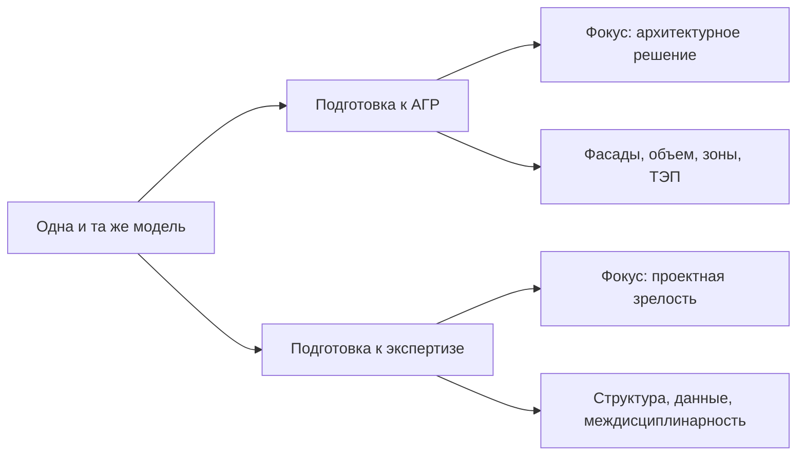

# Чем экспертиза отличается от АГР

## О чем эта глава

Это одна из самых важных глав всего модуля. Если не развести АГР и экспертизу в голове, все дальнейшие требования к модели будут путаться между собой.

## Простое объяснение темы

АГР и экспертиза — это разные процессы, даже если в обоих случаях фигурируют модель, цифровые материалы и внешняя проверка.

Если говорить просто:

- АГР в большей степени связано с архитектурно-градостроительной логикой и тем, как объект читается как архитектурное решение;
- экспертиза в большей степени связана с общей проектной зрелостью, формальной проверяемостью и согласованностью документации и модели.

## Зачем важно это различать

Пока человек не видит этой разницы, он начинает переносить ожидания из одного процесса в другой:

- где-то переоценивает фасадную часть там, где важнее структура и согласованность;
- где-то недооценивает расчетную и междисциплинарную зрелость;
- где-то думает, что раз модель “прошла АГР”, значит она автоматически готова и для экспертизы.

На практике это почти всегда приводит к болезненным ошибкам.

## В чем ключевая разница

## Схема

Эту развилку удобно держать как две разные траектории работы с одной моделью:

### По цели

АГР смотрит на архитектурное решение и его пригодность к соответствующему согласовательному контуру.

Экспертиза смотрит на проектную систему шире и строже.

### По масштабу

АГР в учебнике прежде всего связано с архитектурной моделью.

Экспертиза тяготеет к более общему проектному охвату и сильнее вовлекает междисциплинарную координацию.

### По типу зрелости модели

Для АГР модель должна быть архитектурно, фасадно, пространственно и расчетно убедительной.

Для экспертизы модель должна быть еще и более устойчивой в логике структуры, данных и согласованности.

## Где это встречается в реальной работе

На практике различие между АГР и экспертизой особенно видно в характере замечаний.

Если координатор не различает эти контуры, он начинает либо готовить слишком “архитектурную” модель к экспертизе, либо, наоборот, перегружать АГР требованиями более позднего и более широкого проектного этапа.

## Что должен делать BIM-координатор

Координатору важно каждый раз задавать себе вопрос:

к какому процессу мы сейчас готовим модель?

От ответа зависят:

- приоритеты проверки;
- глубина требований;
- типы рисков;
- логика подготовки цифрового пакета.

## Типовые ошибки новичков

- Считать АГР и экспертизу почти одним процессом.
- Думать, что различие между ними только в “строгости”.
- Механически переносить списки требований из одного контура в другой.
- Не видеть, что модель может быть хорошо подготовлена к АГР и при этом быть недостаточно зрелой для экспертизы.

## Короткий вывод

АГР и экспертиза нужно различать не формально, а по сути. Это разные процессы с разной целью, разным масштабом и разными ожиданиями от модели.

Для BIM-координатора эта разница критична. Именно она помогает проверять модель не “вообще”, а в логике конкретного внешнего рубежа проекта.

Эта развилка потом напрямую пригодится и в `QC`: чек-лист готовности к АГР и чек-лист готовности к экспертизе не должны совпадать механически.
