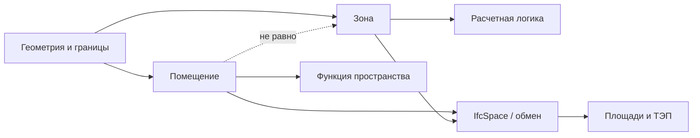

# Логика помещения и зоны

## О чем эта глава

Для новичка слова “помещение” и “зона” часто звучат почти как синонимы. Из-за этого в модели начинают смешиваться разные сущности, а вместе с ними смешивается и вся расчетная логика.

Эта глава нужна, чтобы развести их спокойно и по-рабочему.

## Простое объяснение темы

Помещение и зона решают похожие, но не одинаковые задачи.

Если говорить очень просто:

- помещение обычно связано с конкретным внутренним пространством и его функцией;
- зона чаще используется как расчетная или логическая область, нужная для группировки, контроля и получения показателей.

Не всякая зона равна одному помещению. И не всякое помещение само по себе решает задачу нужного показателя.

## Практический смысл

Для BIM-координатора это важно потому, что многие показатели считаются не просто “по тому, что нарисовано на плане”, а по специально выстроенной пространственной логике.

На практике это означает:

- помещения и зоны должны иметь ясную роль;
- границы должны быть построены корректно;
- у расчетных пространств должны быть нужные атрибуты;
- одна и та же геометрия может участвовать в разных видах проверки по-разному.

Именно здесь тема `IfcSpace` становится особенно важной: проверяющая система хочет видеть не просто контуры, а читаемые пространственные сущности.

## Схема

Чтобы не смешивать эти сущности, удобно держать в голове такую минимальную схему:

## Где это встречается в проекте

На практике BIM-координатор сталкивается с этой темой, когда:

- показатели из модели не сходятся с расчетами;
- помещения визуально есть, но логика зон не собрана;
- зоны построены формально, но не пригодны к выгрузке и проверке;
- один и тот же участок площади попадает в разные расчеты не так, как ожидалось.

Чем ближе проект к АГР и расчетным выгрузкам, тем заметнее становится эта проблема.

## Как это связано с моделью

В модели важно не просто создать пространственный элемент, а понимать, зачем он создан.

Для BIM-координатора здесь особенно критичны:

- правила границ;
- отсутствие случайных разрывов и наложений;
- корректные атрибуты;
- понятная связь между пространством и показателем;
- готовность выгрузить расчетную сущность в читаемом виде.

В локальных материалах по АГР прямо подчеркивается, что расчетные зоны должны выгружаться в IFC как `IfcSpace` и соответствовать логике построения и итоговым значениям.

## Типовые ошибки новичков

- Считать помещение и зону одним и тем же.
- Создавать зоны только для визуального удобства.
- Не проверять границы пространств.
- Думать, что если контур выглядит правильно, то и расчетная логика уже собрана.

## Что делает BIM-координатор

Координатору полезно постоянно держать в голове три вопроса:

1. какую задачу решает данное пространство;
2. по каким правилам оно построено;
3. как это пространство будет читаться в обмене и проверке.

На практике это означает:

- разделять помещения и расчетные зоны по смыслу;
- проверять корректность границ;
- контролировать атрибуты и экспортируемость;
- заранее понимать, какие показатели завязаны на какие пространственные сущности.

## Короткий вывод

Помещение и зона — это не просто два разных слова, а два разных уровня логики модели.

Как только новичок начинает это видеть, площади и ТЭП перестают быть “магией в Excel” и начинают собираться как нормальная система пространственных данных.

Эта глава особенно важна как мост к `IfcSpace`, `XML ТЭП` и проверкам в АГР: если пространственные сущности смешаны по смыслу, дальше начинают расходиться уже не только цифры, но и вся логика обмена.
