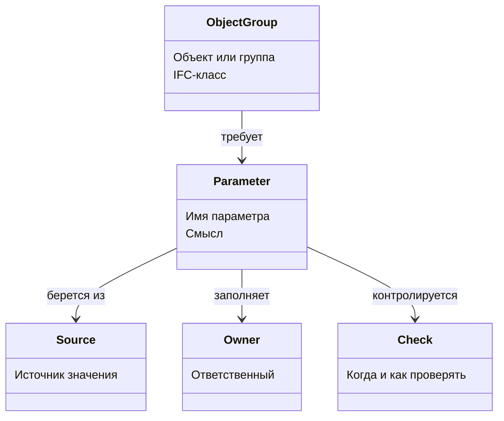

# Построение карты параметров

## О чем эта глава

Когда требований к модели становится много, держать их в голове уже невозможно. Нужен рабочий инструмент, который собирает логику параметризации в одну систему.

Таким инструментом и является карта параметров.

## Простое объяснение темы

Карта параметров — это таблица или согласованная схема, которая показывает, какие данные должны быть у объекта и как с ними работать.

Обычно она отвечает на такие вопросы:

- к какому типу сущности относится объект;
- какой у него IFC-класс;
- какие параметры для него обязательны;
- откуда берутся значения;
- кто отвечает за заполнение;
- как и когда выполняется проверка.

Именно карта параметров превращает разрозненные требования в управляемый процесс.

## Зачем это существует

Без карты параметров команда быстро попадает в знакомую ловушку:

- проектировщики не понимают, что именно им нужно заполнять;
- BIM-специалисты создают лишние поля;
- одни и те же данные дублируются в разных местах;
- проверки становятся хаотичными;
- замечания начинают повторяться от выдачи к выдаче.

Карта параметров нужна затем, чтобы заранее связать между собой требования, источники данных и ответственных.

## Как выглядит хорошая карта параметров

Хорошая карта не обязана быть гигантской. Но в ней обычно есть несколько устойчивых колонок:

- объект или группа объектов;
- IFC-класс или иная сущностная привязка;
- параметр;
- смысл параметра;
- источник значения;
- ответственный;
- способ заполнения;
- этап или момент проверки;
- примечание о рисках и спорных местах.

Если у проекта есть внутренние организационные поля, их лучше выделять отдельно, чтобы они не смешивались с обязательным базовым ядром требований.

## Схема

В упрощенном виде карта параметров связывает между собой такие сущности:

## Где это встречается в реальной работе

На практике карта параметров нужна:

- при запуске проекта;
- при согласовании шаблона модели;
- при настройке параметров перед экспортом и проверкой;
- при разборе повторяющихся замечаний;
- при передаче логики от BIM-специалиста к проектировщикам и обратно.

Для новичка это один из самых полезных инструментов, потому что он делает невидимую логику модели видимой.

## Что должен делать BIM-координатор

BIM-координатор обычно:

1. собирает требования из документов и таблиц;
2. отделяет обязательное ядро от внутренних надстроек;
3. назначает владельцев значений;
4. фиксирует способ заполнения и проверки;
5. регулярно очищает карту от дублирования и мертвых полей.

Здесь особенно важна дисциплина. Плохая карта параметров не помогает проекту. Она только создает иллюзию порядка.

## Типовые ошибки новичков

- Считать картой параметров любой длинный список полей.
- Не связывать параметры с конкретными объектами и ответственными.
- Смешивать обязательные требования, желательные рекомендации и внутренние привычки команды в один слой.
- Добавлять корпоративные поля в основное ядро карты без отдельной пометки.

## Короткий вывод

Карта параметров нужна, чтобы модель можно было не просто наполнять данными, а управлять этим наполнением.

Для BIM-координатора это один из главных рабочих инструментов: именно он помогает переводить документы и требования в понятную операционную схему.

Именно здесь особенно полезно отдельно помечать внутренние корпоративные поля, в том числе служебные надстройки бюро, чтобы обязательное ядро модели не смешивалось с локальными удобствами проекта или организации.
