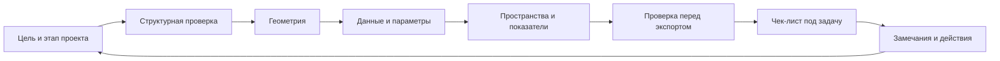

# Модуль 10. Проверка качества модели и контроль перед выдачей

## Зачем нужен этот модуль

К этому моменту читатель уже прошел через BIM, роль координатора, `Revit`, `IFC`, АГР, экспертизу, зоны, площади и параметры. Но все эти знания остаются разрозненными, если не собрать их в воспроизводимую систему проверки.

Именно это и делает модуль 10.

## Главная задача модуля

Задача модуля — показать контроль качества модели не как набор случайных проверок перед сдачей, а как профессиональную процедуру, которая соединяет:

- геометрию;
- данные;
- пространственную логику;
- экспорт;
- готовность к внешней передаче.

## Что особенно важно понять

Новичку полезно увидеть несколько опорных мыслей:

- `quality control` в BIM не сводится к коллизиям;
- у разных этапов проекта разные контрольные задачи;
- есть геометрические и негеометрические ошибки, и обе группы одинаково важны;
- проверка перед экспортом должна происходить до внешней передачи, а не вместо нее;
- готовность к АГР и готовность к экспертизе похожи только частично.

## Схема

Если собрать это в один цикл, логика `QC` выглядит так:

## Что будет дальше

После этого модуля читатель должен уметь смотреть на модель глазами контроля, а не только глазами автора. Это один из самых важных профессиональных переходов для BIM-координатора.

Именно здесь теория окончательно превращается в рабочий процесс.

Дальше эта логика естественно продолжится в модуле про практическую работу на проекте: там контроль качества уже проявляется не как глава учебника, а как ежедневный ритм действий, замечаний и решений.
