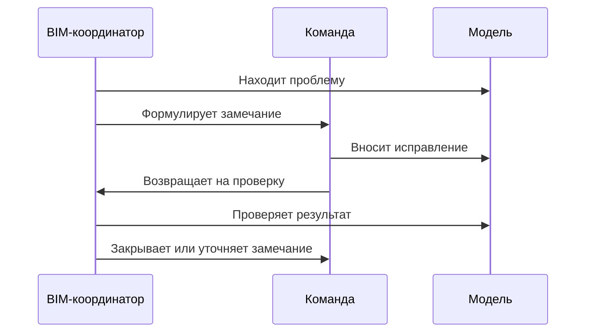

# Работа с замечаниями

## О чем эта глава

Почти вся практическая работа BIM-координатора так или иначе проходит через замечания. Но новичок часто видит в них только поток претензий или список задач на исправление.

Эта глава нужна, чтобы показать замечание как рабочий инструмент управления качеством.

## Простое объяснение темы

Замечание — это не просто фраза о том, что "что-то не так". Хорошее замечание должно помогать понять:

- в чем именно проблема;
- где она находится;
- почему это важно;
- кто должен реагировать;
- что считать исправлением.

Если этого нет, замечание начинает создавать шум, а не порядок.

## Зачем это существует

Без нормальной работы с замечаниями проект быстро скатывается в одну из двух крайностей:

- либо замечаний слишком много и они бесполезно повторяются;
- либо проблемы не фиксируются нормально и живут в устных разговорах.

Работа с замечаниями нужна затем, чтобы превратить результаты проверки в управляемые действия.

## Где это встречается в реальной работе

Для BIM-координатора замечания появляются постоянно:

- после внутреннего аудита;
- после координационных проверок;
- после анализа IFC;
- после АГР;
- после экспертизы;
- при разборе повторных ошибок внутри команды.

Именно поэтому качество замечаний напрямую влияет на качество всего BIM-процесса.

## Каким должно быть хорошее замечание

Хорошее замечание обычно:

- конкретно;
- проверяемо;
- адресно;
- без лишней эмоциональности;
- связано с причиной проблемы, а не только с симптомом.

Чем яснее замечание, тем меньше лишнего шума в проекте.

## Схема

Жизненный цикл хорошего замечания удобно видеть так:

## Что должен делать BIM-координатор

Координатору полезно:

1. писать замечания так, чтобы по ним можно было реально работать;
2. группировать повторяющиеся проблемы;
3. не плодить дублирующие и расплывчатые формулировки;
4. связывать замечания с типом риска и приоритетом;
5. отслеживать не только отправку замечания, но и качество его закрытия.

## Типовые ошибки новичков

- Писать замечания слишком общо.
- Подменять замечание эмоциональной реакцией.
- Не указывать, в чем именно состоит проблема и что проверять после исправления.
- Считать отправку замечания завершением работы.

## Короткий вывод

Работа с замечаниями — это не бюрократическая нагрузка, а один из главных инструментов BIM-координатора. Именно через нее проверка превращается в реальные изменения модели и процесса.

Для новичка особенно важно понять: сильное замечание не просто указывает на ошибку, а помогает ее осмысленно устранить.

Дальше эта логика напрямую переходит в коммуникацию: даже хорошее замечание не сработает, если его не донести в правильном тоне и в правильном масштабе до нужного участника проекта.
