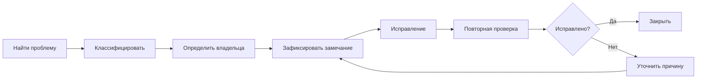

# Работа с замечаниями

Почти вся прикладная работа координатора проходит через замечания, но сами по себе замечания еще ничего не улучшают. Улучшает проект только управляемый `issue-flow`, в котором понятно:

- откуда появилось замечание;
- какого оно типа;
- кто должен отреагировать;
- что считается исправлением;
- кто и когда проверяет результат повторно.

Если этой логики нет, проект быстро скатывается в две крайности: либо замечаний становится слишком много и они начинают дублировать друг друга, либо проблемы живут в устных разговорах и никуда не попадают.

## Замечание — это единица потока, а не просто текст

Хорошее замечание не ограничивается фразой “здесь ошибка”. В рабочем проекте оно должно стать небольшой, но полноценной единицей процесса.

Минимально в нем полезно видеть:

- где находится проблема;
- в чем она состоит;
- почему она важна именно для текущей цели проекта;
- кому она адресована;
- на какое требование, приложение, чек-лист или правило оно опирается;
- как будет проверяться исправление.

Чем раньше координатор начинает мыслить так, тем меньше в проекте бесполезного шума.

## Как выглядит нормальный issue-flow

Это важная развилка: работа не заканчивается в момент отправки замечания. Если замечание вернулось без результата, координатору нужно либо уточнить формулировку, либо понять, что проблема не в исполнителе, а в исходной постановке, в спорной норме или в более глубокой системной ошибке.

Формат передачи замечания здесь вторичен, но не случаен. На проекте оно может жить в письме, таблице, трекере задач или `BCF`. Важно не столько имя инструмента, сколько то, сохраняются ли адресность, привязка к месту в модели, ссылка на требование и статус повторной проверки.

## Что особенно важно в формулировке

Хорошее замечание обычно сочетает пять качеств:

| Что важно | Зачем это нужно |
| --- | --- |
| Конкретность | чтобы исполнителю не пришлось угадывать, что именно от него хотят |
| Проверяемость | чтобы координатор мог повторно проверить результат |
| Адресность | чтобы не возникало “это не ко мне” |
| Спокойный тон | чтобы замечание не превращалось в конфликт |
| Связь с риском | чтобы команда понимала, почему это вообще важно |
| Связь с требованием | чтобы замечание не выглядело личным мнением координатора |

Очень полезно писать замечание не только как симптом, но и как тип причины: геометрия, структура модели, параметры, классификация, пространства, передача, координация. Тогда позже проще увидеть повторяющиеся слабые места, а не просто накопить длинный список.

На зрелом проекте это дает еще один эффект: замечания начинают работать не только как локальные задачи, но и как обратная связь по целым слоям системы — именованию, `IFC`-сущностям, `Pset_*`, `RusSet_*`, комплектности цифрового пакета, качеству приложений и маршруту передачи.

## Что делать с повторяющимися проблемами

Одна из самых частых ошибок новичка — писать двадцать похожих замечаний и считать, что работа сделана. На практике куда полезнее:

1. отделить единичный сбой от системной причины;
2. сгруппировать повторяющиеся ошибки;
3. поднять вопрос на уровень рабочей договоренности, шаблона или мини-инструкции;
4. после исправления проверить, что проблема не вернулась в соседних файлах и разделах.

Именно здесь замечания перестают быть бюрократией и становятся инструментом улучшения среды проекта.

## Что особенно нельзя путать

- замечание не равно эмоциональной реакции;
- замечание не равно авторскому вкусу координатора;
- отправка замечания не равна его закрытию;
- отсутствие ответа не значит, что замечание понято;
- отсутствие ссылки на требование не делает замечание автоматически неверным, но резко ухудшает его управляемость;
- слишком общее замечание почти всегда порождает лишнюю переписку вместо исправления.

## Короткий вывод

Сильная работа с замечаниями — это не “умение писать придирки”, а умение переводить результаты проверки в управляемый поток действий. Для координатора это один из центральных профессиональных навыков: через него проверка начинает менять не только модель, но и сам ритм проекта.

Именно поэтому замечания так важны и для следующего модуля handbook. Когда координатор начинает видеть в них не отдельные фразы, а повторяющиеся типы причин, они превращаются в карту профессиональных ошибок, спорных случаев и системных провалов.
