# MODEL CHECK ROUTE

## Маршрутная схема проверки модели

```mermaid
flowchart LR
    A[Цель проверки] --> B[Стадия и внешний рубеж]
    B --> C[Структура модели]
    C --> D[Пространства, зоны, показатели]
    D --> E[Данные и параметры]
    E --> F[Геометрические конфликты]
    F --> G[Подготовка к экспорту]
    G --> H[Проверка обменной модели]
    H --> I[Замечания по типам причин]
    I --> J[Блокеры и второстепенные проблемы]
    J --> K[Подготовка к АГР или экспертизе]
    K --> L[Следующий цикл действий]
```

1. Понять цель текущей проверки.
2. Определить стадию проекта и внешний рубеж.
3. Проверить общую структуру модели.
4. Проверить пространства, зоны, площади и показатели.
5. Проверить ключевые данные и параметры.
6. Проверить критичные геометрические конфликты.
7. Подготовить модель к экспорту.
8. Проверить результат экспорта как обменную модель.
9. Сформулировать замечания по типам причин.
10. Отделить блокеры от второстепенных проблем.
11. Подготовить комплект к АГР или экспертизе в зависимости от цели.
12. Зафиксировать следующий цикл действий.

Эту маршрутную схему удобно держать рядом с модулями про `QC`, аудит и проектную работу: она помогает не выпадать в хаотичную проверку “по ощущению”.
