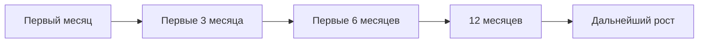

# PERSONAL DEVELOPMENT PLAN

## 1. Первый месяц

- Понять базовую среду проекта
- Перестать путать `Revit`, `IFC`, АГР и экспертизу
- Научиться читать модель как источник данных

## 2. Первые 3 месяца

- Освоить логику зон, площадей, параметров и замечаний
- Начать спокойно читать ключевые документы
- Научиться видеть типовые ошибки модели

## 3. Первые 6 месяцев

- Научиться проводить разумный первичный аудит
- Лучше понимать предэкспортную и внешнюю проверку
- Укрепить работу с замечаниями и рабочими таблицами

## 4. 12 месяцев

- Удерживать модель, требования и проверки как систему
- Работать не только реактивно, но и процессно
- Видеть повторяющиеся риски до того, как они станут кризисом

## 5. Вопросы для самооценки

- Я понимаю, зачем выполняю конкретную проверку?
- Я умею отличать обязательное требование от методики и внутренней практики?
- Я вижу, где проблема модели системная, а где локальная?
- Я умею объяснить свое замечание так, чтобы по нему можно было работать?
- Я стал спокойнее в спорных и неоднозначных ситуациях?

Этот план лучше использовать вместе с финальным модулем про рост: так самооценка остается связанной не с общими ощущениями, а с конкретными рабочими навыками и рубежами.
