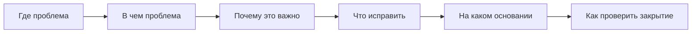

# REMARK TEMPLATE

## Шаблон замечания к модели

**Раздел / модель:**

**Элемент / зона проблемы:**

**Суть проблемы:**

**Почему это важно:**

**Риск:**
- критичный / высокий / средний / низкий

**Что требуется исправить:**

**Основание:**
- нормативный документ / внутренняя инструкция / правило проекта / логика IFC / логика АГР / логика экспертизы

**Комментарий BIM-координатора:**

## Короткие правила хорошего замечания

- Замечание должно быть конкретным.
- Замечание должно быть проверяемым.
- Замечание должно быть связано с причиной или хотя бы с типом риска.
- Замечание не должно превращаться в эмоциональный комментарий.
- После прочтения должно быть понятно, что именно проверять после исправления.
