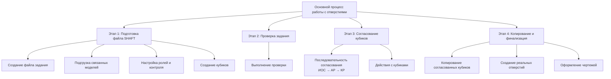

---
title: Работа с отверстиями
sidebar_position: 2
---

Приведенные вами источники описывают рекомендуемый подход к работе с заданиями на отверстия в Revit с использованием плагина FutureBIM, который в первую очередь предполагает **работу в ЕДИНОМ центральном файле "Задание на отверстия"**.

Ваш предварительный сценарий, где "Для каждого файла AR свой файл SHAFT" и "Далее этот файл SHAFT добавляется в файл AR связью", **отличается от стандартной рекомендации FutureBIM**. Согласно источникам, работа с несколькими файлами "Заданий на отверстия" или обмен группами имеет существенные недостатки, такие как:

- Сложность координации
- Временные задержки  
- Невозможность изменения значений в таблицах
- Риск потери данных из-за различных ID у одного и того же кубика в разных моделях
- Постоянная потребность в участии BIM-специалистов

FutureBIM стремится к единой базе данных для совместной работы.

Тем не менее, адаптируем инструкцию под ваш случай, но с учетом важных нюансов и рекомендаций из источников:

## **Инструкция по работе с заданиями на отверстия (адаптировано для вашего проекта)**

В данном подходе предполагается, что файл `MNVNK_ATR_PD_B12.2_K1_SHAFT.rvt` выступает в роли файла "Задание на отверстия" для соответствующей архитектурной модели `MNVNK_ATR_PD_B12.2_K1_AR_R2022.rvt`.

### **Этап 1: Подготовка файла SHAFT и создание "Кубиков" (инженеры / BIM-специалист)**

#### **1. Создание файла задания на отверстия:**

- BIM-специалист или инженер создает новый файл Revit на основе подготовленного шаблона, называя его, например, **`MNVNK_ATR_PD_B12.2_K1_SHAFT.rvt`**
- Шаблон обычно чище от труб, стен, материалов для меньшего веса и быстрой работы
- Файл сохраняется в папку с проектом. Если это Revit Server, то сначала сохраняется локально, потом создается локальная копия, и она кладется на сервер

#### **2. Подгрузка связанных моделей:**

- В файл `MNVNK_ATR_PD_B12.2_K1_SHAFT.rvt` подгружаются **все необходимые связи, которые будут участвовать в формировании отверстий**
- Это включает:
  - **Архитектурная модель:** `MNVNK_ATR_PD_B12.2_K1_AR_R2022.rvt`
  - **Конструктивная модель:** (Например, KR, если она существует)
  - **Инженерные модели:** (Например, ВК и ОВ, или другие инженерные разделы)

**Важно:** Координаты и уровни в файле `MNVNK_ATR_PD_B12.2_K1_SHAFT.rvt` должны соответствовать модели архитектуры.

- Для каждой связанной модели необходимо создать свой рабочий набор и поместить связь в него
- Рекомендуется наименование рабочих наборов связей по формату: `_Поле1_Связь_Поле2` (например, `_01_Связь_АР`, `_02_Связь_КР`, `_03_Связь_ОВ1`)

#### **3. Настройка ролей и контроль изменений (BIM-специалист):**

- В файле `MNVNK_ATR_PD_B12.2_K1_SHAFT.rvt` BIM-специалист активирует функцию **"Контроль изменений"**
- Все участники процесса согласования (инженеры, архитекторы, конструкторы) должны синхронизироваться в модели, чтобы их имена появились в списке ролей
- BIM-специалист назначает роли (например, "инженер", "архитектор", "конструктор")
- Для каждой роли назначаются разрешения на редактирование параметров согласования, например:
  - Инженер может ставить только галочку "Согласовано ИОС"
  - Архитектор – "Согласовано АР" 
  - Конструктор – "Согласовано КР"
- Это предотвращает несанкционированное согласование
- Настройки ролей и разрешений можно экспортировать и импортировать через файл XML для удобства между проектами

**Важное замечание:** "Контроль изменений" будет работать только при установленном плагине FutureBIM у всех участников и активированной галочке "Включить контроль"

#### **4. Создание "Кубиков" (инженеры):**

- Инженеры используют функцию **"Задание на отверстия"** во вкладке "Модель"
- Плагин автоматически создает "кубики" (условное представление инженерного отверстия) в местах пересечения инженерных сетей с несущими конструкциями
- Кубики могут быть круглыми (цилиндры) или прямоугольными (параллелепипеды)
- При создании кубиков плагин автоматически задае