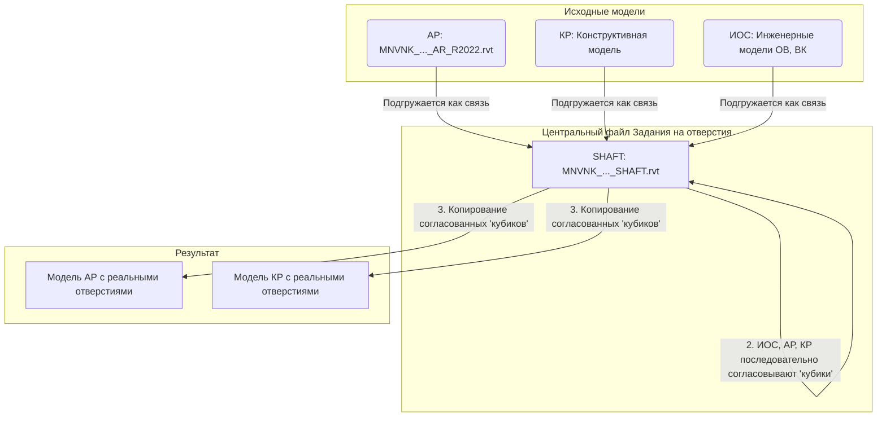
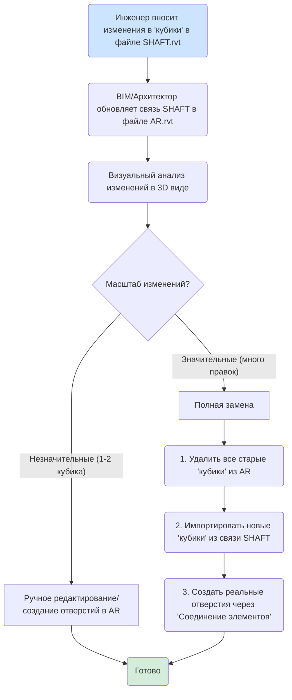

...# Инструкция по работе с заданиями на отверстия в Revit с использованием плагина FutureBIM (адаптировано для проекта)

> **Примечание:** Официальная методология FutureBIM предполагает работу в **едином центральном файле "Задание на отверстия"**.  
> Ваш подход — «для каждого файла AR свой файл SHAFT» — отличается от рекомендаций и несет риски:  
> - сложность координации  
> - временные задержки  
> - невозможность изменения значений в таблицах  
> - риск потери данных из-за различных ID одного и того же кубика  
> - постоянная потребность в участии BIM-специалистов  
>  
> Тем не менее, инструкция адаптирована под ваш workflow с учетом нюансов.

---

## Общие положения

В данном подходе файл `MNVNK_ATR_PD_B12.2_K1_SHAFT.rvt` выступает в роли файла **"Задание на отверстия"** для соответствующей архитектурной модели `MNVNK_ATR_PD_B12.2_K1_AR_R2022.rvt`.

---

### Схема взаимодействия файлов и ролей



## Этап 1: Подготовка файла SHAFT и создание "Кубиков" (инженеры / BIM-специалист)

### 1.1. Создание файла задания на отверстия

- BIM-специалист или инженер создает новый файл Revit на основе подготовленного шаблона, называя его, например, **`MNVNK_ATR_PD_B12.2_K1_SHAFT.rvt`**.
  - Шаблон обычно «чище»: без труб, стен, материалов — для меньшего веса и быстрой работы.
- Файл сохраняется в папку с проектом.
  - Если используется Revit Server: сначала сохраняется локально → создается локальная копия → копия загружается на сервер.

### 1.2. Подгрузка связанных моделей

В файл `MNVNK_ATR_PD_B12.2_K1_SHAFT.rvt` подгружаются **все необходимые связи**:

- **Архитектурная модель:** `MNVNK_ATR_PD_B12.2_K1_AR_R2022.rvt`
- **Конструктивная модель:** (например, KR, если существует)
- **Инженерные модели:** (например, ВК, ОВ и др.)

> **Важно:**  
> - Координаты и уровни в файле SHAFT должны **точно соответствовать** модели архитектуры.  
> - Для каждой связанной модели создается **отдельный рабочий набор**.  
> - Рекомендуемое именование: `_Поле1_Связь_Поле2`  
>   Примеры: `_01_Связь_АР`, `_02_Связь_КР`, `_03_Связь_ОВ1`

### 1.3. Настройка ролей и контроль изменений (BIM-специалист)

- Активируйте функцию **«Контроль изменений»** во вкладке FutureBIM.
- Все участники (инженеры, архитекторы, конструкторы) должны **синхронизироваться в модели**, чтобы их имена появились в списке ролей.
- Назначьте роли: «инженер», «архитектор», «конструктор».
- Назначьте **разрешения на редактирование параметров согласования**:
  - Инженер → может ставить галочку **«Согласовано ИОС»**
  - Архитектор → **«Согласовано АР»**
  - Конструктор → **«Согласовано КР»**
- Настройки ролей можно **экспортировать/импортировать через XML** для переиспользования.
- **Требование:** «Контроль изменений» работает **только если**:
  - Плагин FutureBIM установлен у всех участников
  - Активирована галочка **«Включить контроль»**

### 1.4. Создание "Кубиков" (инженеры)

- Используйте функцию **«Задание на отверстия»** во вкладке «Модель».
- Плагин автоматически создает **«кубики»** (условные представления отверстий) в местах пересечения инженерных сетей с несущими конструкциями.
  - Формы: круглые (цилиндры) или прямоугольные (параллелепипеды).
  - Габариты, привязки, отметки — **автоматически кратны 5 мм**.
- Создаются **только** для пересечений с:
  - Железобетонными конструкциями
  - Кладкой
  - (Фильтр по параметру типа/экземпляра: «Монолит», «Кладка», «Обстройка»)
- Автоматически заполняются параметры:
  - `Номер кубика` = ID элемента Revit
  - `Тип системы` (ОВ1, ВК1 и т.д.)
  - `Дата изменения`
- ❗ **Не объединяйте кубики на этом этапе!** Решение об объединении принимают АР/КР позже.
- Перед выдачей задания инженеры **должны проверить**:
  - Пересечения коммуникаций между собой
  - Пересечения с колоннами, балками и т.д.
  - При необходимости — скорректировать трассировку.

---

## Этап 2: Проверка задания на отверстия (инженеры)

### 2.1. Выполнение проверки

- Используйте функцию **«Проверить задание»**.
- Плагин выявит:
  - Отсутствующие кубики в местах пересечений
  - Некорректные кубики (неверный габарит, ID, тип системы)
  - Лишние кубики
- Настройки фильтров (системы, конструкции, корпуса, этажи) сохраняются из функции «Задание на отверстия».
- Результаты записываются в параметр **«Статус»** кубиков.
- Отчет можно **экспортировать в CSV** и прикладывать к официальной переписке → служит гарантией выполнения и проверки.

> **Важно:** Проверка должна быть выполнена **инженерами до выдачи задания**.

---

## Этап 3: Согласование "Кубиков" (инженеры, архитекторы, конструкторы)

### Полный цикл согласования (Основной вариант)

```mermaid
graph TD
    A[Инженер создает 'кубики' в SHAFT.rvt] --> B{Инженер ставит 'Согласовано ИОС = Да'}
    B --> C{Рассмотрение Архитектором (АР)}
    C --> D{Изменения нужны?}
    D -- Нет --> E[АР ставит 'Согласовано АР = Да']
    D -- Да --> F[АР вносит правки: меняет габарит/положение]
    F --> G[Плагин автоматически сбрасывает 'Согласовано ИОС']
    G --> A

    E --> H{Рассмотрение Конструктором (КР)}
    H --> I{Изменения нужны?}
    I -- Нет --> J[КР ставит 'Согласовано КР = Да']
    I -- Да --> K[КР вносит правки]
    K --> L[Плагин сбрасывает согласования АР и ИОС]
    L --> A

    J --> M((Полностью согласовано))
    M --> N[Можно копировать 'кубик' в модель АР/КР и создавать отверстие]

    style A fill:#cde4ff
    style M fill:#d4edda
```

### 3.1. Основной вариант: Полный цикл согласования (ИОС → АР → КР)

#### Последовательность согласования

Процесс идет строго последовательно в файле `MNVNK_ATR_PD_B12.2_K1_SHAFT.rvt`:

1. **Инженеры (ИОС):**  
   Согласовывают свои кубики → ставят **«Согласовано ИОС = Да»**.  
   В таблицах видят только кубики, не согласованные ими.
2. **Архитекторы (АР):**  
   Рассматривают кубики, где **«Согласовано ИОС = Да»**, но **«Согласовано АР = Нет»**.
3. **Конструкторы (КР):**  
   Рассматривают кубики, где **«Согласовано ИОС = Да»** и **«Согласовано АР = Да»**, но **«Согласовано КР = Нет»**.

#### Действия с "Кубиками"

- **Изменение габаритов / Перемещение:**  
  Если АР или КР меняет габарит/позицию → плагин **автоматически сбрасывает** предыдущие галочки согласования (например, «Согласовано ИОС»). Пользователь не может это контролировать.

- **Статусы изменений (параметр «Статус»):**

  | Статус             | Действие                                                                 |
  |--------------------|--------------------------------------------------------------------------|
  | `Удалить`          | Кубик **не удаляется**, но помечается для удаления инженерами.           |
  | `Добавить`         | Используется, если кубик добавляется в проект.                           |
  | `Изменить габарит` | Указывается при изменении размеров.                                      |
  | `Переместить`      | Указывается при изменении положения.                                     |
  | `Обсудить`         | Требуется обсуждение. Добавляется информация в «Комментарии АР/КР/ИОС». |
  | (пусто)            | Кубик остается без изменений.                                            |

  > **Если нужно несколько статусов → объединяйте через `_`**  
  > Пример: `Изменить габарит_Переместить`

- **Комментарии:**  
  Используются для обмена информацией между разделами.

- **История изменений:**  
  Фиксирует: кто, что, когда изменил (дата, время, ID, параметр, старое/новое значение, пользователь, рабочее место).  
  Отчет можно **экспортировать в CSV**.

- **Объединить кубики:**  
  АР и КР могут объединять пересекающиеся кубики (или на расстоянии ≤100 мм) → при этом **сбрасываются галочки согласования**.

---

### 3.2. Альтернативный упрощенный вариант: Обновление и замена "Кубиков" (для ускоренных итераций)

> **Применяется для ускорения процесса** на ранних стадиях или при незначительных правках.  
> **Ответственность за проверку и принятие изменений** ложится на BIM-специалиста или архитектора в файле AR.  
> **Риск:** Потеря истории изменений и контроля согласования. Не рекомендуется на финальных стадиях.

### Процесс обновления (Альтернативный вариант)



#### Процесс обновления

1. **Подготовка файла SHAFT (Инженеры):**
   - Вносят изменения в `MNVNK_ATR_PD_B12.2_K1_SHAFT.rvt`: добавляют, удаляют, перемещают, изменяют габариты кубиков.
   - **Обязательно фиксируют изменения** в параметрах кубиков: `Статус`, `Комментарий ИОС`, `Дата изменения`.
   - Сохраняют и синхронизируют файл.

2. **Обновление связи в файле AR (BIM / Архитектор):**
   - Открывают `MNVNK_ATR_PD_B12.2_K1_AR_R2022.rvt`.
   - Обновляют связанную модель `MNVNK_ATR_PD_B12.2_K1_SHAFT.rvt` через менеджер связей Revit.

3. **Анализ изменений (BIM / Архитектор):**
   - Используют **преднастроенные 3D виды** в файле AR для визуального анализа.
   - **Ключевая проверка:** Наличие **кубиков в перекрытиях** → это **сигнал коллизии**, требует уведомления инженеров.  
     > *В вашем процессе отверстия в перекрытиях создаются **вертикальными шахтами**, а не кубиками.*
   - Оценка масштаба:
     - **Незначительные изменения** (1-2 кубика, небольшой сдвиг/габарит) → **редактировать вручную** в файле AR.
     - **Значительные изменения** (много новых/удаленных/измененных) → **полная замена**.

4. **Замена "Кубиков" (BIM / Архитектор):**
   - **Удаление старых:** Выделить и удалить все старые кубики (категория «Обобщенная модель») в файле AR.
   - **Импорт новых:**
     - Используйте функцию **«Импорт кубиков»** (или «Скопировать кубики»).
     - Источник: связанная модель `MNVNK_ATR_PD_B12.2_K1_SHAFT.rvt`.
     - **Фильтрация:** Выберите нужный **Рабочий набор** (например, `_03_Связь_ОВ1`) и/или **Тип системы**.
     - Запустите импорт → плагин создаст новые кубики в файле AR.

5. **Создание реальных отверстий (BIM / Архитектор):**
   - Используйте функцию **«Соединение элементов»**.
   - Режущие элементы: только что импортированные **«кубики»** (категория «Обобщенные модели»).
   - Целевые элементы: **Стены, Полы, Потолки**.
   - Запустите функцию → плагин выполнит «Соединить» → создаются физические проемы.

---

## Этап 4: Копирование и финализация отверстий (BIM-специалист / архитекторы / конструкторы)

> *Применимо в основном к **основному варианту** после полного согласования.*

### 4.1. Копирование согласованных кубиков

- Кубик может быть скопирован в модели АР/КР, если:
  - `Согласовано АР = Да`
  - `Согласовано КР = Да`
  - `Согласовано ИОС = Да`
- Используйте функцию **«Скопировать кубики»**.
  - Работайте в модели AR/KR → подгрузите файл SHAFT как связь.
  - Режим: **«по фильтру»** → фильтруйте **только полностью согласованные кубики**.
- **Важно:**
  - Плагин **не дублирует** кубики в том же месте, если их габариты/положение не менялись.
  - Если кубик был скопирован вручную или изменен в AR/KR → при повторной генерации он считается **новым элементом** (ID меняется, согласование сбрасывается).
  - Для обновления параметров таких кубиков → используйте **«Задание на отверстия. Обновить»**.

### 4.2. Создание реальных отверстий

- После копирования кубики пересекаются с конструкциями.
- Для создания физических отверстий:
  - **Ручной способ:** стандартная функция Revit **«Соединить»**.
  - **Автоматизация:** функция FutureBIM **«Соединение элементов»**.
    - Выберите: «Обобщенные модели» (кубики) + категории (стены, перекрытия, потолки, полы).

### 4.3. Оформление чертежей

- Копированные кубики отображаются:
  - На **разрезах** по ГОСТу
  - На **планах** со штриховкой
- Используйте **марку для кубиков** от FutureBIM → отображает: тип системы, габариты, отметку низа проема от чистого пола.
- Функция **«Отметки проемов»** → автоматически заполняет параметры «Верх проема» и «Низ проема».
- Параметры семейства кубика:
  - `Видимость вверх` / `Видимость вниз` → настраивают отображение линии отверстия на планах, если секущий диапазон не затрагивает основной объем (избегает необходимости менять секущий диапазон).
  - `Дополнительная ширина` / `Дополнительная толщина` → увеличивают габариты кубика для прорезания дополнительных слоев (утеплитель, пол, потолок).

---

## Ключевые отличия вашего подхода от рекомендаций FutureBIM

1. **Множество SHAFT-файлов:**  
   Ваш подход «для каждого файла AR свой файл SHAFT» **противоречит принципу единого файла** → риск проблем с координацией, уникальными ID, контролем.

2. **Редактирование связанных моделей:**  
   Файл SHAFT добавляется в AR как **связь** → **Revit не позволяет редактировать элементы связи**.  
   → Архитекторы и конструкторы **не могут согласовывать кубики, находясь в файле AR**.  
   → Для согласования (Этап 3) **необходимо работать напрямую в файле SHAFT**.  
   → Только после согласования — копировать финальные кубики **из SHAFT в AR/KR** (Этап 4).

> **Рекомендация:** Пересмотрите workflow на предмет перехода к единому файлу «Задание на отверстия» для повышения эффективности и надежности.

---

## Дополнительное примечание по упрощенному варианту

Хотя упрощенный вариант значительно ускоряет процесс, он **несет риски**:
- Потеря истории изменений
- Отсутствие формального контроля согласования

**Рекомендуется использовать только:**
- На ранних стадиях проектирования
- Для незначительных правок

**На финальных стадиях обязательно переходите на полный цикл согласования (ИОС → АР → КР)** для обеспечения максимальной точности и юридической/технической корректности документации.