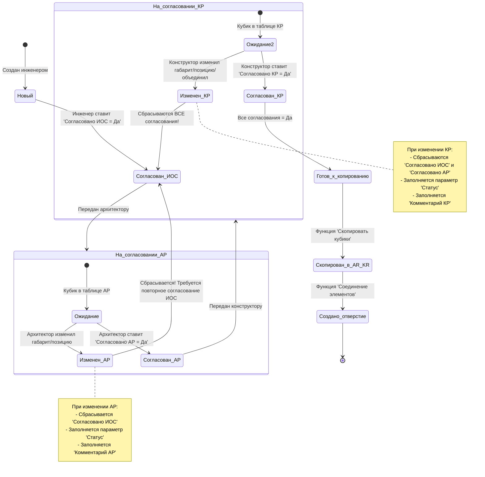

# Инструкция по работе с заданиями на отверстия в Revit с использованием плагина FutureBIM (адаптировано для проекта)

> **Примечание:** Официальная методология FutureBIM предполагает работу в **едином центральном файле "Задание на отверстия"**.  
> Ваш подход — «для каждого файла AR свой файл SHAFT» — отличается от рекомендаций и несет риски:  
> - сложность координации  
> - временные задержки  
> - невозможность изменения значений в таблицах  
> - риск потери данных из-за различных ID одного и того же кубика  
> - постоянная потребность в участии BIM-специалистов  
>  
> Тем не менее, инструкция адаптирована под ваш workflow с учетом нюансов.

---

## Общие положения

В данном подходе файл `MNVNK_ATR_PD_B12.2_K1_SHAFT.rvt` выступает в роли файла **"Задание на отверстия"** для соответствующей архитектурной модели `MNVNK_ATR_PD_B12.2_K1_AR_R2022.rvt`.

```mermaid
%%{init: {'theme': 'base', 'themeVariables': { 'primaryColor': '#ffd54f', 'secondaryColor': '#4fc3f7'}}}%%
graph TD
    A[Начало: Инженеры создали/обновили кубики в файле SHAFT] --> B{Какой вариант работы?}
    B -->|Полный цикл согласования<br><small>(финальные стадии, юридическая точность)</small>| C[Согласование в файле SHAFT: ИОС → АР → КР]
    B -->|Упрощенный вариант<br><small>(ранние стадии, быстрые итерации)</small>| D[Обновление связи в файле AR]
    C --> E[Копирование СОГЛАСОВАННЫХ кубиков из SHAFT в AR/KR]
    D --> F[Анализ изменений: ручная правка или полная замена?]
    F -->|Незначительные| G[Редактировать существующие кубики вручную]
    F -->|Значительные| H[Удалить старые кубики в AR → Импортировать новые из SHAFT]
    E --> I[Создание отверстий: функция 'Соединение элементов']
    G --> I
    H --> I
    I --> J[Оформление чертежей]
    style A fill:#a5d6a7,stroke:#388e3c
    style B fill:#fff176,stroke:#fbc02d
    style C fill:#4fc3f7,stroke:#0288d1
    style D fill:#ffcc80,stroke:#fb8c00
    style E fill:#4fc3f7,stroke:#0288d1
    style F fill:#ffcc80,stroke:#fb8c00
    style G fill:#ffcc80,stroke:#fb8c00
    style H fill:#ffcc80,stroke:#fb8c00
    style I fill:#a5d6a7,stroke:#388e3c
    style J fill:#a5d6a7,stroke:#388e3c
```

---

## Этап 1: Подготовка файла SHAFT и создание "Кубиков" (инженеры / BIM-специалист)

### 1.1. Создание файла задания на отверстия

- BIM-специалист или инженер создает новый файл Revit на основе подготовленного шаблона, называя его, например, **`MNVNK_ATR_PD_B12.2_K1_SHAFT.rvt`**.
  - Шаблон обычно «чище»: без труб, стен, материалов — для меньшего веса и быстрой работы.
- Файл сохраняется в папку с проектом.
  - Если используется Revit Server: сначала сохраняется локально → создается локальная копия → копия загружается на сервер.

### 1.2. Подгрузка связанных моделей

В файл `MNVNK_ATR_PD_B12.2_K1_SHAFT.rvt` подгружаются **все необходимые связи**:

- **Архитектурная модель:** `MNVNK_ATR_PD_B12.2_K1_AR_R2022.rvt`
- **Конструктивная модель:** (например, KR, если существует)
- **Инженерные модели:** (например, ВК, ОВ и др.)

> **Важно:**  
> - Координаты и уровни в файле SHAFT должны **точно соответствовать** модели архитектуры.  
> - Для каждой связанной модели создается **отдельный рабочий набор**.  
> - Рекомендуемое именование: `_Поле1_Связь_Поле2`  
>   Примеры: `_01_Связь_АР`, `_02_Связь_КР`, `_03_Связь_ОВ1`

### 1.3. Настройка ролей и контроль изменений (BIM-специалист)

- Активируйте функцию **«Контроль изменений»** во вкладке FutureBIM.
- Все участники (инженеры, архитекторы, конструкторы) должны **синхронизироваться в модели**, чтобы их имена появились в списке ролей.
- Назначьте роли: «инженер», «архитектор», «конструктор».
- Назначьте **разрешения на редактирование параметров согласования**:
  - Инженер → может ставить галочку **«Согласовано ИОС»**
  - Архитектор → **«Согласовано АР»**
  - Конструктор → **«Согласовано КР»**
- Настройки ролей можно **экспортировать/импортировать через XML** для переиспользования.
- **Требование:** «Контроль изменений» работает **только если**:
  - Плагин FutureBIM установлен у всех участников
  - Активирована галочка **«Включить контроль»**

### 1.4. Создание "Кубиков" (инженеры)

- Используйте функцию **«Задание на отверстия»** во вкладке «Модель».
- Плагин автоматически создает **«кубики»** (условные представления отверстий) в местах пересечения инженерных сетей с несущими конструкциями.
  - Формы: круглые (цилиндры) или прямоугольные (параллелепипеды).
  - Габариты, привязки, отметки — **автоматически кратны 5 мм**.
- Создаются **только** для пересечений с:
  - Железобетонными конструкциями
  - Кладкой
  - (Фильтр по параметру типа/экземпляра: «Монолит», «Кладка», «Обстройка»)
- Автоматически заполняются параметры:
  - `Номер кубика` = ID элемента Revit
  - `Тип системы` (ОВ1, ВК1 и т.д.)
  - `Дата изменения`
- ❗ **Не объединяйте кубики на этом этапе!** Решение об объединении принимают АР/КР позже.
- Перед выдачей задания инженеры **должны проверить**:
  - Пересечения коммуникаций между собой
  - Пересечения с колоннами, балками и т.д.
  - При необходимости — скорректировать трассировку.

---

## Этап 2: Проверка задания на отверстия (инженеры)

### 2.1. Выполнение проверки

- Используйте функцию **«Проверить задание»**.
- Плагин выявит:
  - Отсутствующие кубики в местах пересечений
  - Некорректные кубики (неверный габарит, ID, тип системы)
  - Лишние кубики
- Настройки фильтров (системы, конструкции, корпуса, этажи) сохраняются из функции «Задание на отверстия».
- Результаты записываются в параметр **«Статус»** кубиков.
- Отчет можно **экспортировать в CSV** и прикладывать к официальной переписке → служит гарантией выполнения и проверки.

> **Важно:** Проверка должна быть выполнена **инженерами до выдачи задания**.

---

## Этап 3: Согласование "Кубиков" (инженеры, архитекторы, конструкторы)

### 3.1. Основной вариант: Полный цикл согласования (ИОС → АР → КР)

```mermaid
%%{init: {'theme': 'base', 'themeVariables': { 'primaryColor': '#e1bee7', 'secondaryColor': '#ba68c8'}}}%%
graph LR
    subgraph "Файл: MNVNK_ATR_PD_B12.2_K1_SHAFT.rvt"
    direction TB
    A[Инженеры (ИОС)<br>1. Создают/редактируют кубики<br>2. Ставят 'Согласовано ИОС = Да'<br>3. Экспорт отчета CSV] --> B[Архитекторы (АР)<br>1. Проверяют кубики (ИОС=Да, АР=Нет)<br>2. Могут: Переместить, Изменить габарит, Объединить<br>3. Сбрасывается 'Согласовано ИОС'<br>4. Ставят 'Согласовано АР = Да'] --> C[Конструкторы (КР)<br>1. Проверяют кубики (ИОС=Да, АР=Да, КР=Нет)<br>2. Могут: Переместить, Изменить габарит, Объединить<br>3. Сбрасываются 'Согласовано ИОС' и 'Согласовано АР'<br>4. Ставят 'Согласовано КР = Да']
    end
    C --> D[Кубик согласован всеми!]
    D --> E[Копирование в файлы AR/KR<br>Функция 'Скопировать кубики'<br>Фильтр: ИОС=Да, АР=Да, КР=Да]
    style A fill:#bbdefb,stroke:#1976d2
    style B fill:#c8e6c9,stroke:#388e3c
    style C fill:#ffccbc,stroke:#bf360c
    style D fill:#a5d6a7,stroke:#2e7d32
    style E fill:#a5d6a7,stroke:#2e7d32
```

#### Последовательность согласования

Процесс идет строго последовательно в файле `MNVNK_ATR_PD_B12.2_K1_SHAFT.rvt`:

1. **Инженеры (ИОС):**  
   Согласовывают свои кубики → ставят **«Согласовано ИОС = Да»**.  
   В таблицах видят только кубики, не согласованные ими.
2. **Архитекторы (АР):**  
   Рассматривают кубики, где **«Согласовано ИОС = Да»**, но **«Согласовано АР = Нет»**.
3. **Конструкторы (КР):**  
   Рассматривают кубики, где **«Согласовано ИОС = Да»** и **«Согласовано АР = Да»**, но **«Согласовано КР = Нет»**.

#### Действия с "Кубиками"



- **Изменение габаритов / Перемещение:**
  Если АР или КР меняет габарит/позицию → плагин **автоматически сбрасывает** предыдущие галочки согласования (например, «Согласовано ИОС»). Пользователь не может это контролировать.

- **Статусы изменений (параметр «Статус»):**

  | Статус             | Действие                                                                 |
  |--------------------|--------------------------------------------------------------------------|
  | `Удалить`          | Кубик **не удаляется**, но помечается для удаления инженерами.           |
  | `Добавить`         | Используется, если кубик добавляется в проект.                           |
  | `Изменить габарит` | Указывается при изменении размеров.                                      |
  | `Переместить`      | Указывается при изменении положения.                                     |
  | `Обсудить`         | Требуется обсуждение. Добавляется информация в «Комментарии АР/КР/ИОС». |
  | (пусто)            | Кубик остается без изменений.                                            |

  > **Если нужно несколько статусов → объединяйте через `_`**  
  > Пример: `Изменить габарит_Переместить`

- **Комментарии:**  
  Используются для обмена информацией между разделами.

- **История изменений:**  
  Фиксирует: кто, что, когда изменил (дата, время, ID, параметр, старое/новое значение, пользователь, рабочее место).  
  Отчет можно **экспортировать в CSV**.

- **Объединить кубики:**  
  АР и КР могут объединять пересекающиеся кубики (или на расстоянии ≤100 мм) → при этом **сбрасываются галочки согласования**.

---

### 3.2. Альтернативный упрощенный вариант: Обновление и замена "Кубиков" (для ускоренных итераций)

```mermaid
%%{init: {'theme': 'base', 'themeVariables': { 'primaryColor': '#ffab91', 'secondaryColor': '#d84315'}}}%%
graph TD
    A[Инженеры: Обновили кубики в SHAFT