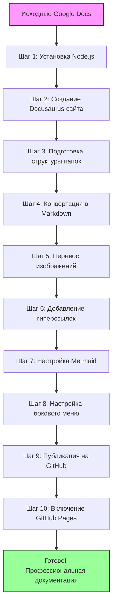
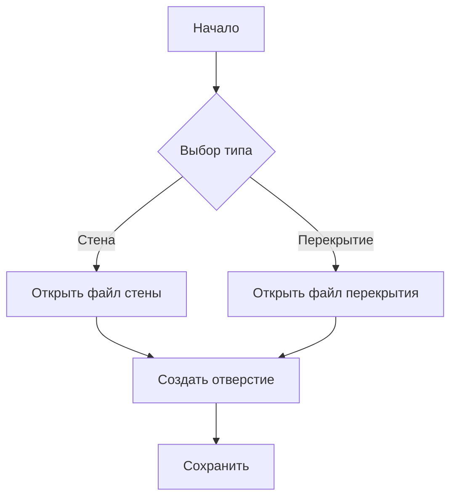
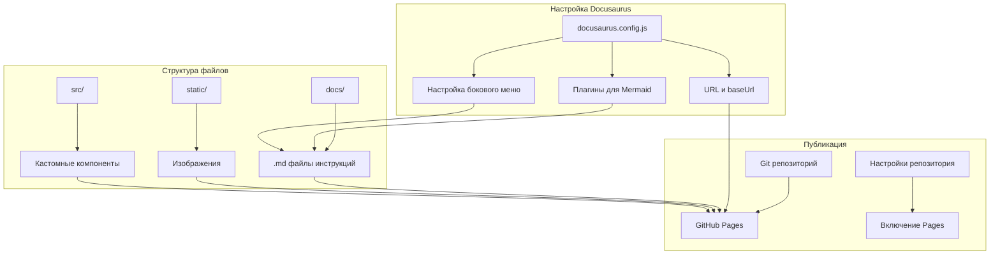
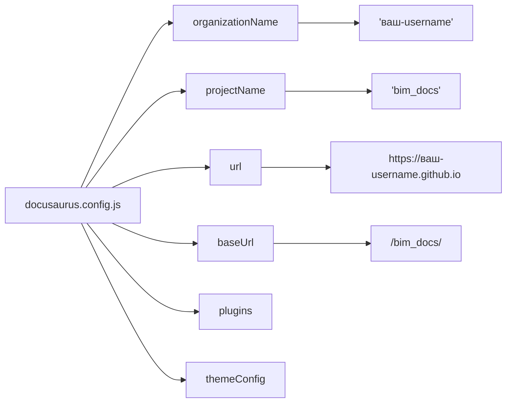

Ниже — **пошаговая инструкция по переносу существующих инструкций из Google Docs в Docusaurus + GitHub Pages**. Это полностью **бесплатное, open-source решение** с профессиональным видом, поддержкой гиперссылок, Mermaid-схем, поиска и масштабирования.

---

# 🧭 Инструкция: Как перенести инструкции из Google Docs в Docusaurus + GitHub Pages

> ✅ Предполагается, что у вас уже есть **аккаунт на GitHub**.

---

## 🎯 Цель

Превратить набор Google Docs-инструкций в красивую, структурированную, связную документацию с гиперссылками, размещенную бесплатно на GitHub Pages.

---

## 📦 Что вы получите в итоге

- Сайт документации по адресу: `https://ваш-github-username.github.io/bim_docs/`
- Поддержка Markdown, изображений, блок-схем (Mermaid), оглавления, поиска.
- Возможность редактировать инструкции через GitHub или локально.
- Автоматическая публикация при обновлении.

---

## 🔄 Процесс переноса документации: общая схема



---

# 🚀 Шаг 1: Установите необходимые инструменты

### 1.1 Установите Node.js (версия ≥ 18)

- Скачайте с [https://nodejs.org](https://nodejs.org) → выберите **LTS версию**.
- Проверьте установку в терминале:

```bash
node -v
npm -v
```

> 💡 Если вы на Windows — используйте **Git Bash** или **Windows Terminal**. На Mac/Linux — обычный терминал.

---

# 🏗️ Шаг 2: Создайте новый сайт Docusaurus

Откройте терминал и выполните:

```bash
npx create-docusaurus@latest bim_docs classic
```

> 💡 `bim_docs` — имя папки вашего проекта. Можно изменить.

Перейдите в папку:

```bash
cd bim_docs
```

Запустите локальный сервер для просмотра:

```bash
npm run start
```

Откройте в браузере: [http://localhost:3000](http://localhost:3000) — вы увидите демо-сайт Docusaurus.

---

# 📁 Шаг 3: Подготовьте структуру документации

Файлы документации хранятся в папке `docs/`.

Удалите примеры:

```bash
rm docs/*.md
rm docs/*.mdx
```

Создайте свою структуру. Например:

```bash
mkdir -p docs/getting-started
mkdir -p docs/workflow
mkdir -p docs/roles
mkdir -p docs/diagrams
```

> 💡 Совет: структурируйте как в Google Docs — каждая инструкция = один `.md` файл.

---

# 📝 Шаг 4: Преобразуйте Google Docs в Markdown

### Вариант A: Вручную (рекомендуется для контроля качества)

1. Откройте Google Doc.
2. Скопируйте текст.
3. Вставьте в [https://word2md.com](https://word2md.com) или [https://cloudconvert.com/docx-to-md](https://cloudconvert.com/docx-to-md) (если экспортировали как .docx).
4. Скачайте `.md` файл.
5. Вручную добавьте **frontmatter** в начало каждого файла:

```md
---
title: Название инструкции
sidebar_position: 1
---
```

> 💡 `sidebar_position` — порядок в меню слева.

6. Вставьте содержимое в соответствующий `.md` файл в папке `docs/`.

---

### Вариант B: Экспорт через Google Docs → .docx → Pandoc (для технических пользователей)

```bash
pandoc -s input.docx -t gfm -o output.md
```

> Требует установки [Pandoc](https://pandoc.org/installing.html).

---

# 🖼️ Шаг 5: Перенесите изображения (скриншоты)

1. Создайте папку `static/img/docs/`:

```bash
mkdir -p static/img/docs
```

2. Сохраните все скриншоты из Google Docs в эту папку (например, `hole-wall-1.png`).

3. В Markdown файлах замените ссылки на изображения:

```md

```

> 💡 В Google Docs изображения встроены — их нужно скачать и сохранить локально.

---

# 🔗 Шаг 6: Добавьте гиперссылки между инструкциями

В Markdown используйте относительные ссылки:

```md
Подробнее о ролях — см. [Распределение ролей](/docs/roles/responsibility).

Перейти к [работе с файлами перекрытий](/docs/workflow/floors).
```

> 💡 Docusaurus автоматически обрабатывает такие ссылки — даже при экспорте в PDF или при смене URL.

---

# 🧩 Шаг 7: Добавьте поддержку Mermaid (блок-схемы)

1. Установите плагин:

```bash
npm install --save docusaurus-plugin-mdx mermaid
```

2. Откройте `docusaurus.config.js` и добавьте в `plugins`:

```js
plugins: [
  [
    '@docusaurus/plugin-content-docs',
    {
      id: 'docs',
      path: 'docs',
      routeBasePath: 'docs',
      sidebarPath: require.resolve('./sidebars.js'),
      editUrl: 'https://github.com/your-username/bim_docs/edit/main/',
    },
  ],
  [
    '@docusaurus/plugin-mdx',
    {
      extensions: ['.mdx', '.md'],
      options: {
        remarkPlugins: [],
        rehypePlugins: [],
        providerImportSource: '@mdx-js/react',
      },
    },
  ],
],
```

3. В `docusaurus.config.js` добавьте в `presets` → `docs` → `remarkPlugins`:

```js
remarkPlugins: [require('remark-math')],
rehypePlugins: [require('rehype-katex'), require('rehype-mermaid')],
```

> ⚠️ Альтернатива (проще): используйте `<Mermaid>` компонент — подробнее [в официальной документации](https://docusaurus.io/docs/markdown-features/diagrams).

Пример в `.md` файле:

````md

````

---

# 🗂️ Шаг 8: Настройте боковое меню (sidebar)

Откройте `sidebars.js` и настройте структуру:

```js
module.exports = {
  docs: [
    {
      type: 'category',
      label: 'Начало работы',
      items: [
        'getting-started/introduction',
        'getting-started/installation',
      ],
    },
    {
      type: 'category',
      label: 'Рабочие процессы',
      items: [
        'workflow/walls',
        'workflow/floors',
        'workflow/synchronization',
      ],
    },
    {
      type: 'category',
      label: 'Роли и ответственность',
      items: [
        'roles/responsibility',
        'roles/checklist',
      ],
    },
  ],
};
```

> 💡 Имена файлов должны совпадать с именами `.md` файлов в `docs/` (без расширения).

---

# 🚀 Шаг 9: Опубликуйте на GitHub Pages

### 9.1 Инициализируйте Git-репозиторий

```bash
git init
git add .
git commit -m "Initial commit: Docusaurus docs"
```

### 9.2 Создайте новый репозиторий на GitHub

- Перейдите на [https://github.com/new](https://github.com/new)
- Назовите репозиторий: `bim_docs` (или как угодно)
- **Не** инициализируйте README, .gitignore или лицензию — у вас уже есть свой проект.

### 9.3 Свяжите локальный проект с GitHub

```bash
git remote add origin https://github.com/ваш-username/bim_docs.git
git branch -M main
git push -u origin main
```

### 9.4 Настройте GitHub Pages в `docusaurus.config.js`

Добавьте в начало файла:

```js
const organizationName = 'ваш-username'; // например, 'ivan-petrov'
const projectName = 'bim_docs';
```

Обновите секцию `url` и `baseUrl`:

```js
url: `https://${organizationName}.github.io`,
baseUrl: `/${projectName}/`,
```

### 9.5 Настройте публикацию

В `docusaurus.config.js` найдите `themeConfig` → `navbar` → `items` и добавьте ссылку на документацию:

```js
{
  to: '/docs/introduction',
  label: 'Документация',
  position: 'left',
},
```

### 9.6 Запустите сборку и публикацию

```bash
npm run build
npm run deploy
```

> Команда `deploy` автоматически опубликует сайт на GitHub Pages.

---

# ⚙️ Шаг 10: Включите GitHub Pages в настройках репозитория

1. Перейдите в репозиторий на GitHub → Settings → Pages.
2. В “Source” выберите: **gh-pages branch** (если не появилось автоматически — подождите 1-2 минуты после `npm run deploy`).
3. Сохраните.

👉 Ваш сайт будет доступен по адресу:

```
https://ваш-username.github.io/bim_docs/
```

---

# 🔄 Шаг 11: Как обновлять документацию в будущем

1. Отредактируйте `.md` файлы локально.
2. Добавьте/обновите изображения в `static/img/docs/`.
3. Закоммитьте изменения:

```bash
git add .
git commit -m "Обновлена инструкция по отверстиям"
git push origin main
npm run deploy
```

> ✅ Всё — сайт автоматически обновится через 1-2 минуты.

---

# 🎁 Бонус: Добавьте поиск (Algolia DocSearch — бесплатно для open-source)

Docusaurus поддерживает [DocSearch от Algolia](https://docsearch.algolia.com) — **бесплатно** для публичных документаций.

1. Зарегистрируйте свой сайт на [https://docsearch.algolia.com/apply/](https://docsearch.algolia.com/apply/)
2. После одобрения (1-7 дней) — вам пришлют API-ключ.
3. Добавьте в `docusaurus.config.js`:

```js
themeConfig: {
  algolia: {
    appId: 'YOUR_APP_ID',
    apiKey: 'YOUR_API_KEY',
    indexName: 'your-index-name',
  },
}
```

---

# 🧑‍💻 Готово!

Теперь у вас есть:

✅ Профессиональная документация  
✅ Гиперссылки между инструкциями  
✅ Блок-схемы (Mermaid)  
✅ Скриншоты  
✅ Поиск (опционально)  
✅ Бесплатный хостинг на GitHub Pages  
✅ Возможность делиться одной ссылкой со всей командой  
✅ Полный контроль и open-source

---


---

## ❓ Вопрос 1: JavaScript или TypeScript — что выбрать?

> Docusaurus предлагает выбрать язык для конфигурации проекта: **JavaScript** или **TypeScript**.

### ✅ Рекомендация: **Выберите `JavaScript`**

#### Почему?

- Вы создаёте **документацию**, а не сложное веб-приложение.
- Вам **не нужны типы TypeScript** — вы будете в основном редактировать `.md` файлы и настраивать `docusaurus.config.js`.
- Конфигурация на JavaScript проще для понимания, если вы не разработчик.
- Всё будет работать так же стабильно.
- Меньше сложностей с настройкой, сборкой, зависимостями.

> 💡 TypeScript — это “JavaScript с типами”, полезен при разработке больших приложений, где важно отлавливать ошибки на этапе написания кода. Для документации — избыточен.

👉 **Выбирайте → `JavaScript`**

---

## ❓ Вопрос 2: Где находится папка `bim_docs`?

> Да, это **обычная папка на вашем локальном компьютере**, куда Docusaurus установит проект.

### 📁 Где она создаётся?

Там, **откуда вы запускаете команду** `npx create-docusaurus@latest bim_docs classic`.

Например:

- Если вы открыли терминал и находитесь в `C:\Users\ВашеИмя\Documents` → папка создастся в `C:\Users\ВашеИмя\Documents\bim_docs`
- Если вы в `~/projects` (на Mac/Linux) → папка будет в `~/projects/bim_docs`

### ✅ Как правильно:

1. Откройте терминал (на Windows — Git Bash, PowerShell или CMD; на Mac — Terminal).
2. Перейдите в удобное для вас место, например:

```bash
cd ~/Documents
# или на Windows:
cd C:\Users\ВашеИмя\Documents
```

3. Запустите:

```bash
npx create-docusaurus@latest bim_docs classic
```

4. После установки — перейдите в папку:

```bash
cd bim_docs
```

> 💡 Совет: назовите папку так, чтобы вам было понятно, например: `revit-docs`, `plugin-instructions`, и т.д.

---

## 🗂️ Что внутри папки `bim_docs`?

После установки вы увидите такую структуру (основное):

```
bim_docs/
├── docs/               ← сюда кладёте все .md файлы инструкций
├── src/                ← кастомные компоненты (пока не нужны)
├── static/             ← изображения, PDF, статические файлы
├── docusaurus.config.js ← главный конфиг сайта (настройки, меню, тема)
├── sidebars.js         ← структура бокового меню
├── package.json        ← зависимости проекта
└── ...
```

---

## 💡 Полезный совет: как открыть папку в редакторе

Чтобы удобно редактировать файлы — откройте папку в **VS Code** (бесплатный редактор от Microsoft):

1. Установите VS Code: [https://code.visualstudio.com](https://code.visualstudio.com)
2. В терминале, находясь в папке `bim_docs`, выполните:

```bash
code .
```

> Точка `.` означает “текущая папка”.

Теперь вы можете редактировать `.md` файлы, конфиги, вставлять изображения — всё в удобном интерфейсе.

---

## ✅ Краткий чек-лист на старте

- [x] Установили Node.js
- [x] Выбрали `JavaScript` при создании проекта
- [x] Создали папку в удобном месте (например, `Documents/bim_docs`)
- [x] Открыли её в VS Code (`code .`)
- [x] Запустили локальный сервер: `npm run start`

---

## 🛠️ Детали настройки: ключевые шаги конфигурации



### 🔧 Ключевые параметры конфигурации:



---

## 🚨 Важно про GitHub Pages и приватность (ещё раз!)

Поскольку вы выбрали GitHub Pages — помните:

> 🔒 **Ваш сайт будет публичным.**
> Если в инструкциях есть **внутренние данные, имена файлов, пути, названия проектов, скриншоты интерфейсов** — подумайте, можно ли это публиковать в открытый доступ.

Если нет — лучше использовать **Notion (по ссылке)** или **локальный хостинг**.

---


