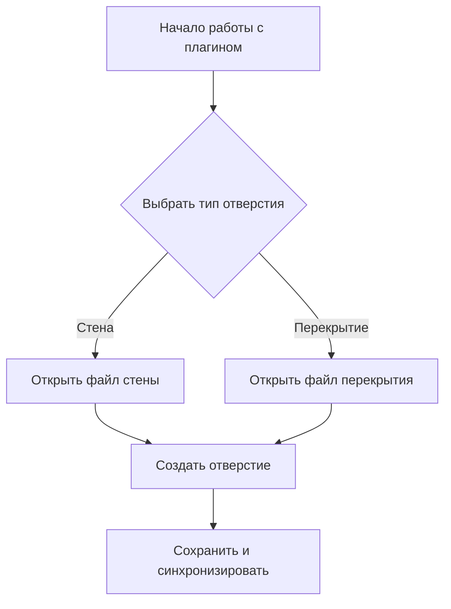

Если у вас **нет собственного хостинга**, а инструкции нужно **разослать сотрудникам** (архитекторам, инженерам и т.д.), которые работают на разных компьютерах, и вы хотите **включить скриншоты, диаграммы и блок-схемы**, то да — **существуют решения лучше, чем Google Docs**, даже в рамках бесплатных и общедоступных сервисов.

---

## ✅ Почему Google Docs — не идеал для такой инструкции?

- **Ограниченная поддержка сложной вёрстки**: вставка диаграмм/блок-схем возможна, но неудобна.
- **Нет встроенной поддержки интерактивных схем** — всё приходится вставлять как картинки.
- **Сложно поддерживать структуру** (оглавление, якоря, навигация по разделам).
- **Неудобно обновлять и контролировать версии** — особенно если много визуального контента.
- **Разметка "плывёт"** при печати или экспорте в PDF.

---

## ✅ Лучшие бесплатные альтернативы (с хостингом и возможностью делиться ссылкой)

### 1. **Notion** — 👍 **Лучший выбор для вашей задачи**

- **Бесплатен** для личного использования и небольших команд (до 5 гостей в рабочем пространстве на бесплатном тарифе — но можно обойти, давая доступ по ссылке).
- **Поддерживает**:
  - Вставку скриншотов, PDF, видео.
  - Встроенные диаграммы через встраивание **Mermaid.js** (блок-схемы, диаграммы последовательностей и т.д. — прямо в Notion!).
  - Таблицы, списки, toggle-блоки, оглавление, якоря.
  - Экспорт в PDF (качественный).
- **Можно делиться ссылкой** — даже с людьми без аккаунта Notion (в режиме “просмотр”).
- **Автоматически сохраняет историю изменений**.
- **Интуитивный интерфейс** — проще, чем Confluence.

> 🎯 **Рекомендую начать с Notion** — он идеально подходит под ваш кейс: визуальная инструкция, распределение ролей, блок-схемы, скриншоты, возможность делиться ссылкой и экспортировать в PDF.

🔗 [notion.so](https://www.notion.so)

---

### 2. **GitBook (новая версия — 2024)** — 🆓 Бесплатный тариф

- Современный, красивый интерфейс для технической документации.
- Поддержка Markdown, вложений, изображений, таблиц.
- Можно создать публичную книгу и делиться ссылкой.
- Бесплатный тариф — до 1000 просмотров в месяц и 3 пространства.
- Подходит для структурированных инструкций с разделами.

> 👉 Хорош, если вы хотите что-то более “официальное” и “документо-ориентированное”, чем Notion.

🔗 [gitbook.com](https://www.gitbook.com)

---

### 3. **Docusaurus + GitHub Pages** — 💡 Для технически подкованных

- **Open-source**, полностью бесплатный.
- Пишете документацию в Markdown, вставляете изображения, диаграммы Mermaid.
- Хостите на **GitHub Pages** — бесплатно, публично доступно.
- Требует минимальных навыков Git и Markdown.
- Автоматическая сборка, красивые темы, мобильная адаптация.

> 👉 Подходит, если в команде есть хотя бы один человек, кто может настроить репозиторий (1–2 часа работы).

🔗 [docusaurus.io](https://docusaurus.io) + [pages.github.com](https://pages.github.com)

---

### 4. **Confluence (Cloud, Free Plan)** — 🆓 для команд до 10 человек

- Очень мощный инструмент для корпоративной документации.
- Отличная поддержка вложений, диаграмм (через плагины или вставку изображений), структуры.
- Бесплатный тариф — до 10 пользователей.
- Можно делиться публичными ссылками (ограниченно).

> 👉 Хорош, если у вас небольшая команда (до 10 человек) и вы хотите “корпоративное” решение.

🔗 [atlassian.com/software/confluence/free](https://www.atlassian.com/software/confluence/free)

---

### 5. **Google Sites** — 🆓 Простая альтернатива Google Docs

- Бесплатно, интеграция с Google Drive.
- Можно вставлять изображения, таблицы, файлы, даже Google Drawings (для схем!).
- Проще структурировать, чем в Docs.
- Делиться по ссылке, настраивать права.

> 👉 Подходит, если вы хотите остаться в экосистеме Google, но Docs вам уже тесен.

🔗 [sites.google.com](https://sites.google.com)

---

## 📌 Что выбрать?

| Задача | Рекомендуемый инструмент |
|--------|---------------------------|
| **Быстро, красиво, с блок-схемами и скриншотами, делиться ссылкой** | → **Notion** |
| **Структурированная техническая документация, как “книга”** | → **GitBook** |
| **Есть технический человек, хочется open-source и контроль** | → **Docusaurus + GitHub Pages** |
| **Команда до 10 человек, нужен “корпоративный” вид** | → **Confluence Free** |
| **Хотим остаться в Google, но Docs не хватает** | → **Google Sites** |

---

## 💡 Дополнительный совет: используйте Mermaid.js для блок-схем

В **Notion**, **GitBook**, **Docusaurus** и других можно вставлять диаграммы через **Mermaid** — это текстовое описание схем, которое автоматически превращается в визуальные блок-схемы, диаграммы Ганта, flowchart и т.д.

Пример:



Это **огромный плюс** — вы можете редактировать схемы как текст, а не перерисовывать картинки!

---

## ✅ Вывод

> **Да, есть решения лучше Google Docs — и они бесплатны.**  
> **Лучший выбор для вашей задачи — Notion.**  
> Он сочетает простоту, визуальную гибкость, поддержку схем (Mermaid), возможность делиться ссылкой и экспортировать в PDF — всё бесплатно.

Если в будущем понадобится больше контроля или масштабирование — переходите на GitBook или Docusaurus.

---

Если инструкций будет **много**, и вам нужны **гиперссылки между ними** (внутренние ссылки, оглавление, перекрёстные ссылки на разделы, файлы, схемы), то выбор инструмента становится ещё более критичным.

Google Docs в этом случае **не справляется**: ссылки на заголовки работают плохо, навигация между документами неудобна, нет единой структуры, и всё быстро превращается в “винегрет” из файлов.

---

## ✅ Требования к идеальному инструменту для множества связанных инструкций:

1. Поддержка **внутренних гиперссылок** (между разделами, документами, якорями).
2. Возможность **структурировать** множество документов (папки, категории, оглавление).
3. **Поиск по всем инструкциям**.
4. **Бесплатный хостинг** + публичный доступ по ссылке.
5. Поддержка **визуального контента**: скриншоты, блок-схемы (Mermaid), таблицы.
6. Удобное **обновление и контроль версий**.

---

## 🏆 Лучшие варианты для множества связанных инструкций с гиперссылками

### 🥇 1. **Notion — всё ещё лучший выбор (даже для множества инструкций)**

✅ **Почему подходит:**

- Можно создать **базу знаний (Knowledge Base)** — одна страница как “главная”, с вложенными подстраницами (инструкциями).
- **Гиперссылки между страницами** работают идеально — просто вставляете `/` и выбираете нужную страницу.
- Поддержка **якорей (оглавления)** внутри страниц — автоматически создаётся кликабельное TOC.
- Можно делать **базы данных** инструкций с тегами, фильтрами, поиском.
- Встроенная поддержка **Mermaid-диаграмм** (блок-схемы, flowchart, sequence diagrams).
- Экспорт в PDF (по одной инструкции или всей базы).
- Делиться можно **публичной ссылкой на всю базу или отдельную страницу**.
- Бесплатен для команд до 5 гостей — но можно обойти, делая страницы “публичными”.

> 💡 **Пример структуры в Notion:**
> ```
> 📚 Главная страница: "Инструкции по Revit Plugin"
>   ├── 📄 Инструкция 1: Работа с отверстиями в стенах
>   ├── 📄 Инструкция 2: Связь с файлами перекрытий
>   ├── 📄 Инструкция 3: Распределение ролей
>   └── 📄 Глоссарий и часто задаваемые вопросы
> ```
> В каждой инструкции — ссылки на другие, например:  
> _"Подробнее о синхронизации файлах — см. соответствующий раздел ниже"_

🔗 [notion.so](https://www.notion.so)

---

### 🥈 2. **GitBook — специально создан для связанных технических документов**

✅ **Почему подходит:**

- Создаёте **“Space”** — как книгу с главами и подглавами.
- Автоматическое **оглавление, навигация, поиск**.
- Поддержка **внутренних ссылок** (`[[Имя страницы]]` или Markdown-ссылки).
- Поддержка **Mermaid**, LaTeX, вложений.
- Можно делать **публичную документацию** — делиться одной ссылкой на всю книгу.
- Бесплатный тариф — до 1000 просмотров/мес и 3 пространства.

> 👉 GitBook чуть более “технический”, чем Notion, но идеален, если вы хотите структуру “как книга” с перекрёстными ссылками.

🔗 [gitbook.com](https://www.gitbook.com)

---

### 🥉 3. **Docusaurus + GitHub Pages — для максимальной гибкости и контроля (open-source)**

✅ **Почему подходит:**

- Полностью **бесплатно**, с открытым кодом.
- Поддержка **Markdown с якорями, внутренними ссылками, TOC**.
- Встроенная поддержка **Mermaid**, LaTeX, вкладок, предупреждений.
- Автоматическая **генерация сайта документации** с поиском, боковым меню, версиями.
- Хостинг на **GitHub Pages** — бесплатно, публично.
- Можно настроить **кастомный домен** позже.
- Идеально масштабируется — хоть 1000 инструкций.

> 👉 Требует немного технических навыков (Git, Markdown, настройка репозитория), но результат — профессиональная документация, как у Facebook, Netflix, React и т.д.

🔗 [docusaurus.io](https://docusaurus.io) + [pages.github.com](https://pages.github.com)

---

### 4. **Confluence Cloud (Free for ≤10 users)**

✅ Подходит, если команда небольшая:

- Отличная система **внутренних ссылок**.
- Иерархия страниц, метки, поиск.
- Можно вставлять диаграммы (через вложения или плагины).
- Делиться можно по ссылке.

> ⚠️ Но: бесплатный тариф — только до 10 пользователей. Если нужно больше — платно.

---

### 5. **Google Sites — как альтернатива в экосистеме Google**

✅ Можно создать структуру сайта с подстраницами, вставлять ссылки, изображения, файлы.

> ⚠️ Но: слабая поддержка поиска, нет Mermaid, нет автоматического оглавления, обновлять сложно. Подходит только если вы **очень** хотите остаться в Google.

---

## 📊 Визуальное сравнение платформ для документации

```mermaid
radar
    title Сравнение платформ для документации
    "Гиперссылки" : [95, 90, 95, 90, 60, 80]
    "Множество инструкций" : [90, 85, 100, 85, 40, 80]
    "Поиск" : [90, 95, 95, 90, 50, 60]
    "Mermaid поддержка" : [90, 90, 95, 60, 0, 0]
    "Бесплатный хостинг" : [90, 80, 100, 80, 90, 90]
    "Простота использования" : [95, 80, 60, 80, 90, 85]
    axis "Notion", "GitBook", "Docusaurus+GH", "Confluence Free", "Google Docs", "Google Sites"
```

### 🔍 Интерпретация диаграммы:

- **Notion** лидирует по простоте использования и поддержке гиперссылок
- **Docusaurus+GH** лучший для масштабирования и технической документации
- **GitBook** идеален для структурированных "книжных" проектов
- **Confluence** хорош для корпоративных команд до 10 человек
- **Google Docs** прост, но ограничен в функциональности
- **Google Sites** базовая альтернатива в экосистеме Google

---

## 📈 Рекомендации по выбору в зависимости от потребностей

```mermaid
graph TD
    A[Нужна быстрая визуальная инструкция?] -->|Да| B[Notion]
    A -->|Нет| C[Нужна техническая документация?]
    C -->|Да| D[Docusaurus+GH]
    C -->|Нет| E[Нужна структура "как книга"?]
    E -->|Да| F[GitBook]
    E -->|Нет| G[Команда до 10 человек?]
    G -->|Да| H[Confluence Free]
    G -->|Нет| I[Остаться в Google?]
    I -->|Да| J[Google Sites]
    I -->|Нет| K[Google Docs]
```

---

## 📊 Сравнение по ключевым параметрам

| Инструмент           | Гиперссылки | Множество инструкций | Поиск | Mermaid | Бесплатный хостинг | Простота |
|----------------------|-------------|----------------------|-------|---------|---------------------|----------|
| **Notion**           | ✅ Отлично    | ✅ Да                 | ✅     | ✅       | ✅                  | ⭐⭐⭐⭐⭐     |
| **GitBook**          | ✅ Отлично    | ✅ Да                 | ✅     | ✅       | ✅ (лимиты)         | ⭐⭐⭐⭐      |
| **Docusaurus+GH**    | ✅ Отлично    | ✅ Да (масштабируемо) | ✅     | ✅       | ✅                  | ⭐⭐⭐ (техн.)|
| **Confluence Free**  | ✅ Отлично    | ✅ Да                 | ✅     | ⚠️ Через плагины | ✅ (до 10 чел.)     | ⭐⭐⭐⭐      |
| **Google Docs**      | ⚠️ Ограничено | ❌ Неудобно           | ⚠️     | ❌       | ✅                  | ⭐⭐⭐⭐⭐     |
| **Google Sites**     | ✅            | ✅                    | ⚠️     | ❌       | ✅                  | ⭐⭐⭐⭐      |

---

## ✅ Рекомендация

> **Для большинства команд — выбирайте Notion.**  
> Он сочетает **максимум гибкости, простоты, поддержки гиперссылок и визуального контента** — и всё это бесплатно и без хостинга.

> **Если вы техническая команда и хотите “настоящую” документацию как у open-source проектов — Docusaurus + GitHub Pages.**

> **Если вам нужна структура “как книга” и вы готовы к лимитам — GitBook.**

---

## 💡 Бонус: Как организовать гиперссылки в Notion

1. Создайте **главную страницу** “База знаний Revit Plugin”.
2. На ней — список всех инструкций (можно в виде базы данных или простого списка).
3. В каждой инструкции:
   - Используйте `/link to page` — чтобы вставить ссылку на другую инструкцию.
   - Используйте `/table of contents` — чтобы создать автоматическое оглавление внутри страницы.
   - Используйте `/callout` или `/toggle` — чтобы скрывать сложные блоки.
   - Используйте `/mermaid` — для вставки блок-схем.

---

Если хотите — могу подготовить для вас **шаблон Notion-базы знаний** с примерами структуры, гиперссылок и Mermaid-схем — просто скажите!