# Методология работы с Mermaid диаграммами

## Введение и назначение методологии

Mermaid — это язык для создания диаграмм и графиков на основе текстового синтаксиса, который легко интегрируется в Markdown-документы. В нашем проекте мы используем Mermaid для визуализации сложных процессов, архитектурных решений и рабочих процессов.

**Назначение методологии:**
- Стандартизировать создание и оформление диаграмм в проекте
- Предотвратить распространенные ошибки при работе с Mermaid
- Обеспечить корректное отображение диаграмм в Docusaurus
- Создать единый подход к визуализации информации

## Настройка Mermaid в Docusaurus

### Конфигурация проекта

Для корректной работы Mermaid в Docusaurus необходимо:

1. Установить тему Mermaid:
```bash
npm install @docusaurus/theme-mermaid
```

2. Добавить тему в конфигурацию `docusaurus.config.js`:
```javascript
const config = {
  // ... другие настройки
  themes: ['@docusaurus/theme-mermaid'],
  markdown: {
    mermaid: true,
  },
  // ... другие настройки
};
```

3. Проверить корректность отображения диаграмм после перезапуска сервера.

### Проверка работы Mermaid

Для проверки работы Mermaid диаграмм можно использовать скрипт `check_mermaid_working.js`, который:
- Автоматически открывает браузер
- Переходит на страницу с диаграммами
- Проверяет наличие SVG элементов
- Фиксирует ошибки в консоли

## Этапы работы с Mermaid диаграммами на примере графов

Рассмотрим полный цикл работы с диаграммами на примере графов (Graph), которые являются наиболее часто используемым типом диаграмм в нашем проекте.

### Этап 1: Планирование диаграммы

**Цель:** Определить структуру и содержание диаграммы.

**Действия:**
1. Определите тип графа (TD - сверху вниз, LR - слева направо)
2. Составьте список узлов и связей между ними
3. Определите стили для разных типов узлов
4. Продумайте комментарии и примечания

**Пример планирования:**
```
Узлы:
- Начало процесса
- Выбор варианта
- Полный цикл согласования
- Упрощенный вариант
- Анализ изменений
- Создание отверстий
- Оформление чертежей

Связи:
Начало → Выбор варианта
Выбор варианта → Полный цикл / Упрощенный вариант
Полный цикл → Создание отверстий
Упрощенный вариант → Анализ изменений
Анализ изменений → Создание отверстий
Создание отверстий → Оформление чертежей
```

### Этап 2: Создание базовой структуры

**Цель:** Создать минимально работающую диаграмму.

**Действия:**
1. Начните с простого синтаксиса
2. Используйте базовые узлы и связи
3. Проверьте корректность отображения

**Пример базовой структуры:**
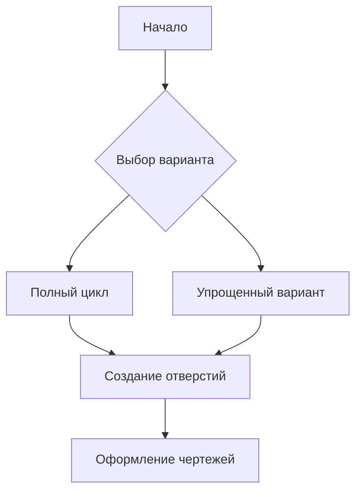

### Этап 3: Добавление стилей и оформления

**Цель:** Улучшить визуальное представление диаграммы.

**Действия:**
1. Добавьте стили для узлов
2. Настройте цвета и границы
3. Добавьте комментарии и примечания

**Пример стилизации:**
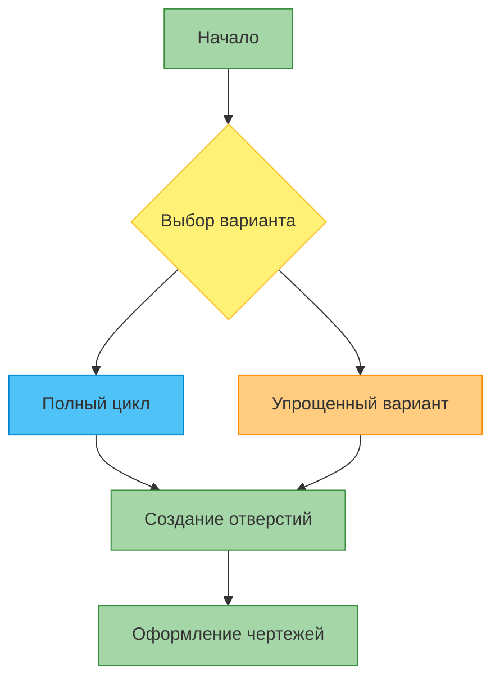

### Этап 4: Добавление сложных элементов

**Цель:** Расширить функциональность диаграммы.

**Действия:**
1. Добавьте подграфы (subgraph)
2. Используйте разные типы связей
3. Добавьте примечания и комментарии

**Пример с подграфами:**
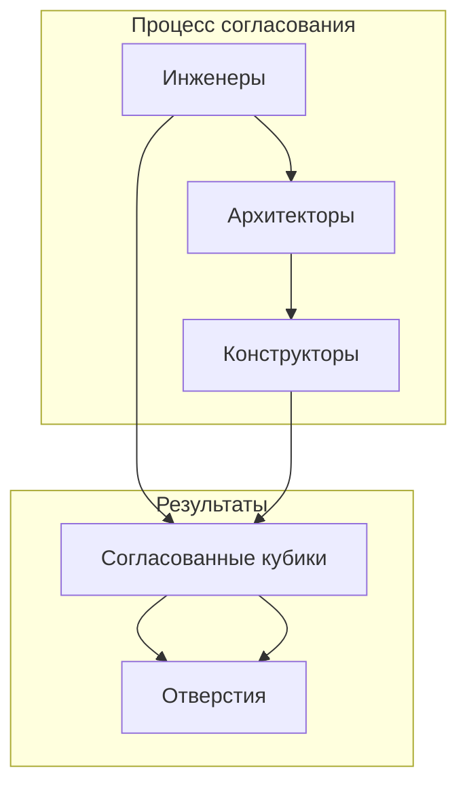

### Этап 5: Проверка и отладка

**Цель:** Убедиться в корректности отображения диаграммы.

**Действия:**
1. Проверьте синтаксис диаграммы
2. Убедитесь в правильности связей
3. Проверьте отображение в разных браузерах
4. Используйте инструменты для проверки ошибок

**Инструменты проверки:**
- Онлайн-редактор Mermaid
- Скрипты проверки в проекте
- Визуальная проверка в Docusaurus

## Подробное описание по типам диаграмм

### Графы (Graph)

Графы используются для визуализации связей между элементами и процессов.

#### Базовый синтаксис
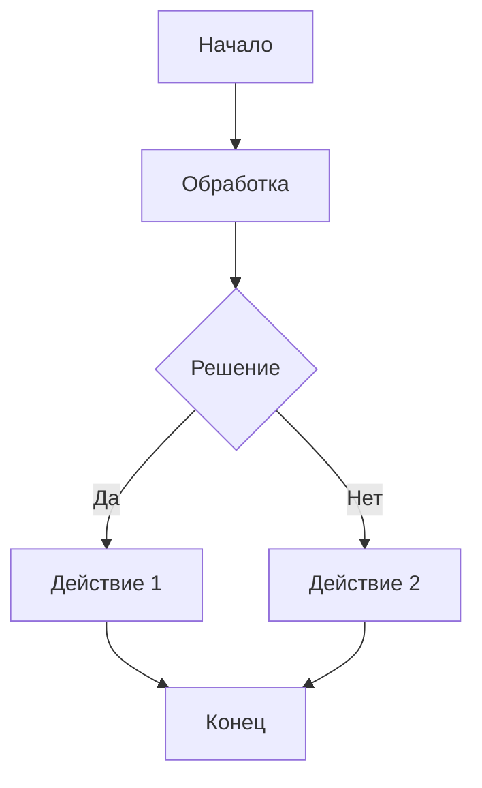

#### Особенности синтаксиса
- `graph TD` - граф сверху вниз (Top Down)
- `graph LR` - граф слева направо (Left Right)
- `graph RL` - граф справа налево (Right Left)
- `graph BT` - граф снизу вверх (Bottom Top)

#### Стилизация
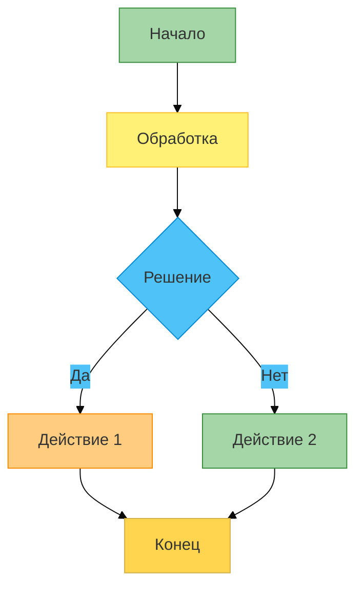

#### Пример из проекта
```mermaid
%%{init: {'theme': 'base', 'themeVariables': { 'primaryColor': '#ffd54f', 'secondaryColor': '#4fc3f7'}}}%%
graph TD
    A[Начало: Инженеры создали/обновили кубики в SHAFT] --> B{Какой вариант работы?}
    B -->|Полный цикл согласования<br><small>(финальные стадии, юридическая точность)</small>| C[Согласование в файле SHAFT: ИОС → АР → КР]
    B -->|Упрощенный вариант<br><small>(ранние стадии, быстрые итерации)</small>| D[Обновление связи в файле AR]
    C --> E[Копирование СОГЛАСОВАННЫХ кубиков из SHAFT в AR/KR]
    D --> F[Анализ изменений: ручная правка или полная замена?]
    F -->|Незначительные| G[Редактировать существующие кубики вручную]
    F -->|Значительные| H[Удалить старые кубики в AR → Импортировать новые из SHAFT]
    E --> I[Создание отверстий: функция 'Соединение элементов']
    G --> I
    H --> I
    I --> J[Оформление чертежей]
    style A fill:#a5d6a7,stroke:#388e3c
    style B fill:#fff176,stroke:#fbc02d
    style C fill:#4fc3f7,stroke:#0288d1
    style D fill:#ffcc80,stroke:#fb8c00
    style E fill:#4fc3f7,stroke:#0288d1
    style F fill:#ffcc80,stroke:#fb8c00
    style G fill:#ffcc80,stroke:#fb8c00
    style H fill:#ffcc80,stroke:#fb8c00
    style I fill:#a5d6a7,stroke:#388e3c
    style J fill:#a5d6a7,stroke:#388e3c
```

### Блок-схемы (Flowchart)

Блок-схемы используются для визуализации алгоритмов и процессов.

#### Базовый синтаксис
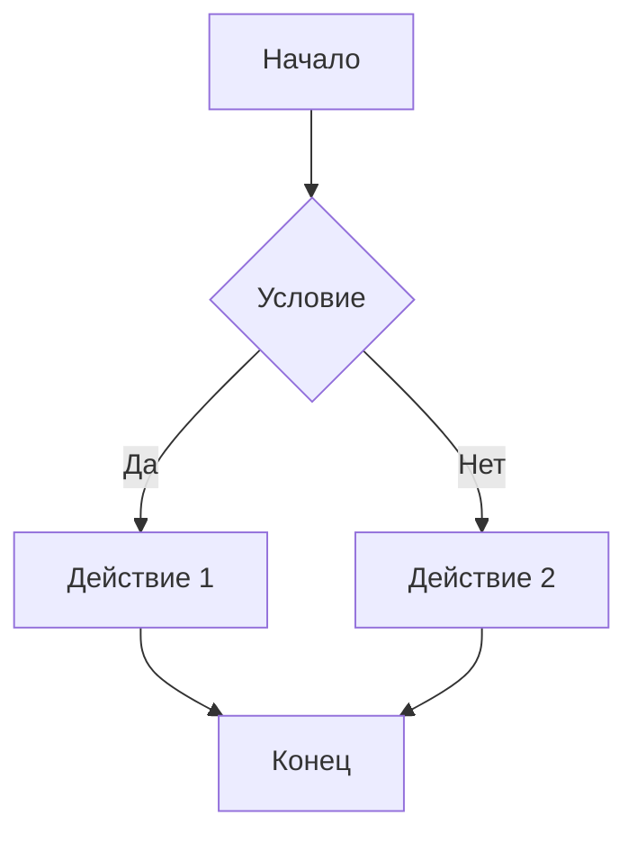

#### Типы узлов
- `[]` - прямоугольник (процесс)
- `()` - овал (начало/конец)
- `{}` - ромб (решение)
- `//` - параллелограмм (ввод/вывод)

#### Пример из проекта
```mermaid
flowchart TD
    A[Создание файла SHAFT] --> B[Подгрузка связанных моделей]
    B --> C[Настройка ролей и контроль изменений]
    C --> D[Создание "Кубиков"]
    D --> E[Проверка задания]
    E --> F[Согласование "Кубиков"]
    F --> G[Копирование и финализация]
    
    style A fill:#e3f2fd,stroke:#1976d2
    style B fill:#e8f5e8,stroke:#2e7d32
    style C fill:#fff3e0,stroke:#ef6c00
    style D fill:#fce4ec,stroke:#c2185b
    style E fill:#f3e5f5,stroke:#7b1fa2
    style F fill:#e0f2f1,stroke:#00796b
    style G fill:#e8eaf6,stroke:#3f51b5
```

### Диаграммы последовательностей (Sequence Diagram)

Диаграммы последовательностей используются для визуализации взаимодействия между объектами во времени.

#### Базовый синтаксис
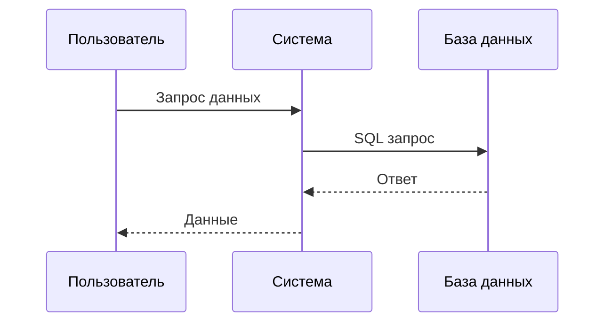

#### Особенности синтаксиса
- `participant` - определение участника
- `->>` - синхронное сообщение
- `-->>` - асинхронное сообщение
- `->` - синхронное сообщение без стрелки
- `--` - асинхронное сообщение без стрелки

#### Пример из проекта
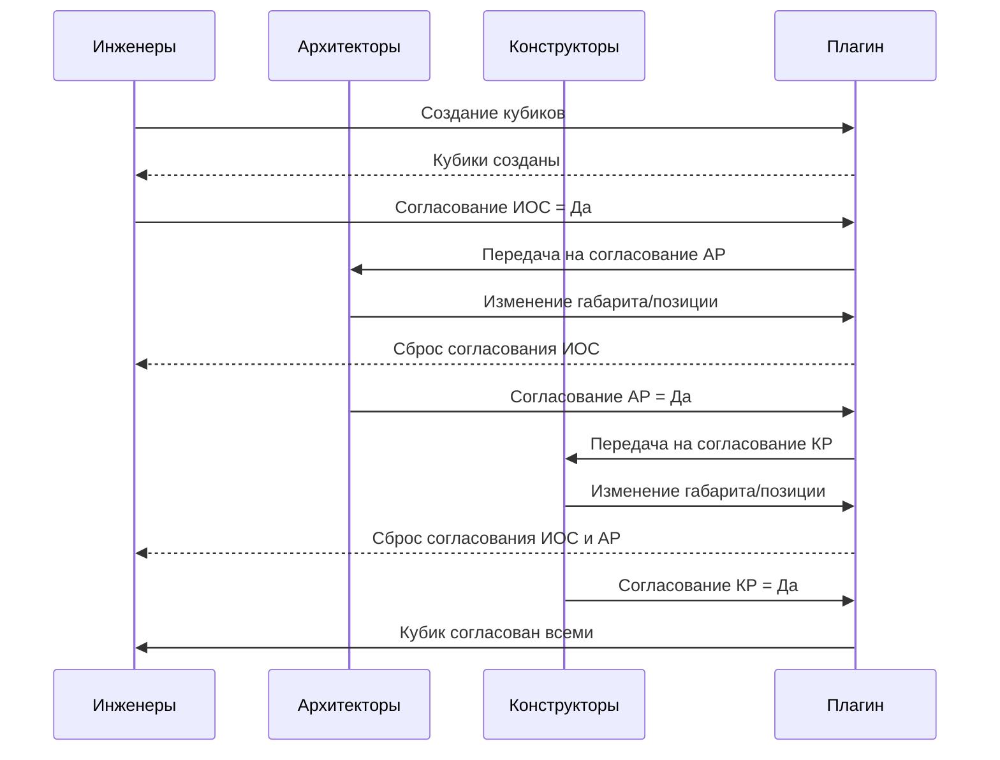

### Диаграммы состояний (State Diagram)

Диаграммы состояний используются для визуализации состояний системы и переходов между ними.

#### Базовый синтаксис
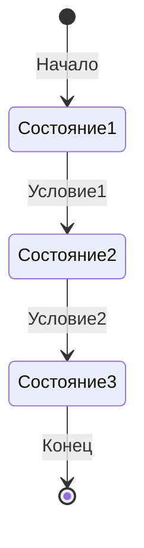

#### Особенности синтаксиса
- `stateDiagram-v2` - версия 2 с улучшенными возможностями
- `[*]` - начальное состояние
- `-->` - переход между состояниями
- `note` - добавление примечаний

#### Пример из проекта
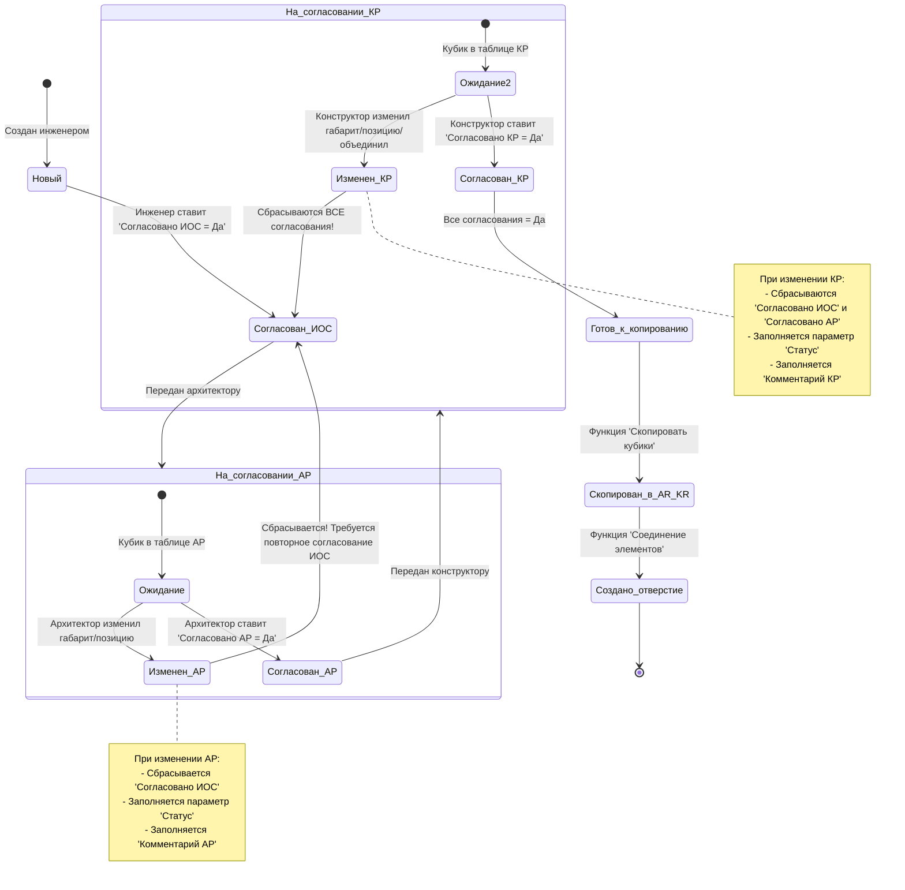

### Диаграммы классов (Class Diagram)

Диаграммы классов используются для визуализации структуры системы в объектно-ориентированном программировании.

#### Базовый синтаксис
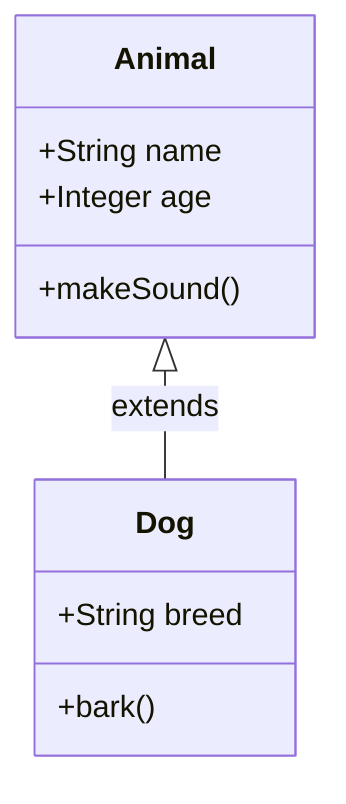

#### Особенности синтаксиса
- `class` - определение класса
- `+` - публичный метод/свойство
- `-` - приватный метод/свойство
- `#` - защищенный метод/свойство
- `<|--` - наследование
- `*--` - композиция
    `o--` - агрегация

### Диаграммы Ганта (Gantt Chart)

Диаграммы Ганта используются для визуализации планирования проектов.

#### Базовый синтаксис
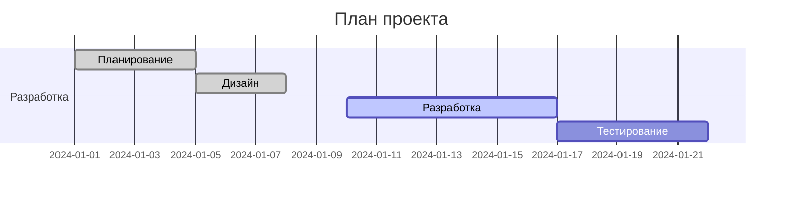

### Диаграммы отношений (Entity Relationship Diagram)

Диаграммы отношений используются для визуализации баз данных.

#### Базовый синтаксис
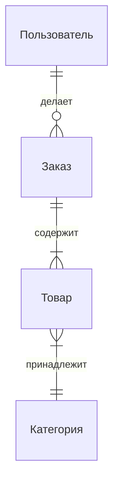

### Диаграммы пользовательского пути (Journey Diagram)

Диаграммы пользовательского пути используются для визуализации опыта пользователя.

#### Базовый синтаксис
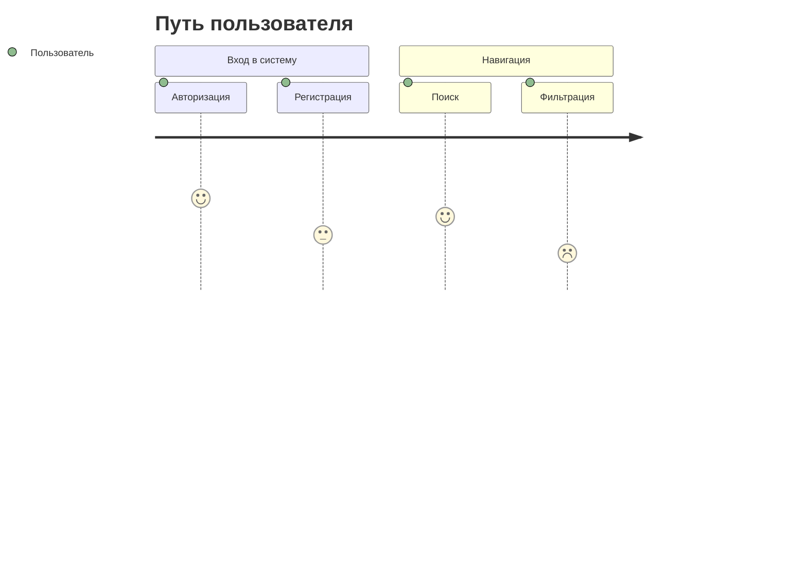

## Лучшие практики и распространенные ошибки

### Лучшие практики

1. **Начинайте с простого**
   - Создавайте базовую структуру перед добавлением сложных элементов
   - Проверяйте корректность отображения на каждом этапе

2. **Используйте стили для улучшения читаемости**
   - Применяйте цветовые схемы для разных типов элементов
   - Используйте комментарии для пояснения сложных участков

3. **Разбивайте сложные диаграммы на части**
   - Используйте подграфы для логической группировки элементов
   - Создавайте отдельные диаграммы для разных аспектов процесса

4. **Документируйте диаграммы**
   - Добавляйте заголовки и описания
   - Используйте комментарии для пояснения логики

5. **Проверяйте синтаксис**
   - Используйте онлайн-редакторы для проверки синтаксиса
   - Тестируйте отображение в разных браузерах

### Распространенные ошибки

1. **Неправильное форматирование**
   - Проблема: Отсутствие правильных отступов и форматирования
   - Решение: Используйте консистентное форматирование и проверяйте синтаксис

2. **Сложные связи**
   - Проблема: Запутанные связи между элементами
   - Решение: Разбивайте диаграммы на части или используйте подграфы

3. **Неоптимальное расположение элементов**
   - Проблема: Элементы расположены неудобно для чтения
   - Решение: Experiment с разными направлениями графа (TD, LR, RL)

4. **Отсутствие стилей**
   - Проблема: Диаграммы выглядят монотонно
   - Решение: Добавьте стили для улучшения визуального представления

5. **Слишком большие диаграммы**
   - Проблема: Диаграммы трудно читать на мобильных устройствах
   - Решение: Разбивайте на части или используйте зумирование

## Инструменты для проверки и отладки диаграмм

### Онлайн-редакторы

1. **Mermaid Live Editor**
   - Адрес: https://mermaid.live
   - Возможности: Редактирование в реальном времени, экспорт изображений

2. **Mermaid Chart Editor**
   - Адрес: https://mermaid-js.github.io/mermaid-live-editor
   - Возможности: Подсветка синтаксиса, предпросмотр

### Скрипты проверки в проекте

1. **check_mermaid_working.js**
   - Проверяет работу Mermaid диаграмм на локальном сервере
   - Фиксирует ошибки в консоли браузера
   - Создает скриншоты для визуальной проверки

2. **check_mermaid_errors.js**
   - Проверяет наличие ошибок, связанных с Mermaid
   - Анализирует консольные сообщения браузера

### Методы отладки

1. **Пошаговая проверка**
   - Начинайте с минимальной диаграммы
   - Добавляйте элементы по одному
   - Проверяйте отображение после каждого изменения

2. **Изоляция проблем**
   - Выделяйте проблемные участки кода
   - Проверяйте синтаксис отдельных частей диаграммы

3. **Визуальная проверка**
   - Используйте скриншоты для сравнения
   - Проверяйте отображение в разных браузерах

## Заключение

Эта методология предоставляет единый подход к работе с Mermaid диаграммами в нашем проекте. Следуя рекомендациям и избегая распространенных ошибок, вы сможете создавать качественные и понятные диаграммы, которые будут корректно отображаться в Docusaurus.

Важно помнить, что практика является ключом к созданию эффективных диаграмм. Экспериментируйте с разными типами диаграмм, стилями и подходами, чтобы найти оптимальное решение для ваших задач.